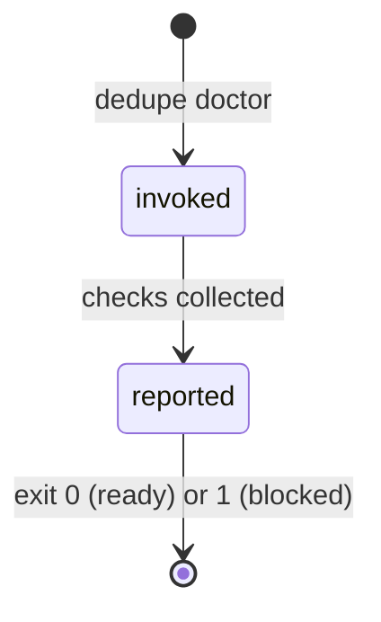

# `doctor`

## Summary

`doctor` checks whether Dedupe has everything it needs to run on this machine and reports each requirement as ready or not. It is the command to run when something else fails mysteriously, on a new machine before first use, or after an operating-system or Python upgrade. It is reached as `dedupe doctor`, takes one optional flag (`--json`), prints a short report to stdout, and exits 0 when core operation is ready, 1 when something blocks it. It never scans media and never touches the user's files.

## The simple case

The user runs `dedupe doctor`. The command prints the Dedupe version, the Python running it, and the platform, then one line per required import (PIL, imagehash, pybktree, send2trash, flask), one line each for ffmpeg and ffprobe with their version strings, one line for the optional OpenCV/YuNet person detector, one line per application path it needs to write (cache, state, keep decisions), and a final line: `Core operation: ready`. The exit code is 0. Nothing on disk changes except that the directories holding the application's own files are created if missing.

If something is missing — a Python package cannot be imported or an application directory is not writable — the corresponding line says `MISSING` or `NOT writable`, the final line reads `Core operation: BLOCKED` with the blockers implied by those lines, and the exit code is 1. ffmpeg, ffprobe, and OpenCV are *not* blockers: they are optional capabilities, and their absence never changes the exit code.

## The interaction, event by event



`doctor` has no extended phase: the whole run is a single collection-and-report step with no user decisions in flight. The five invocation phases collapse to three real moments: parse, check, report.

### Invoke

The arguments are parsed like any other subcommand. `doctor` accepts exactly one flag, `--json`, and no positional arguments; anything else is a usage error reported by argparse before any check runs. Nothing is validated beyond that, because nothing else is input: the command inspects the machine, not a target the user supplies.

The first visible output is the full report; there is no progress phase and no preamble. The checks run in a fixed order and are fast: five module imports, two subprocess version probes with a five-second timeout each, one OpenCV import plus a file existence check, and three directory writability checks.

### Exit immediately

`dedupe doctor --help` prints the subcommand help and exits 0 without running any check. An unrecognized flag exits 2 from argparse with a usage message on stderr. Because the command takes no paths, there is no class of "bad input" failures; the only ways to exit before checking are help and usage errors.

### Begin running

The checks begin at once. One side effect happens before any output: for each application path (cache, state, keep decisions), the directory that would contain the file is created if it does not exist. On a brand-new machine this means `~/.cache/dedupe` and `~/.local/state/dedupe` appear as a result of running `doctor`. The check is then "can I write in this directory?", never a write to the file itself; an existing review session or cache is not opened or modified.

The executable probes run `ffmpeg -version` and `ffprobe -version` with a five-second timeout and take the first line of output as the version. If the binary is missing from `PATH`, the line reads `not found`.

### While running

There is no streaming or progress: the report is assembled in memory and printed all at once. The plain-text report is:

```
dedupe 0.1.0
Python 3.14.7 (/path/to/.venv/bin/python)
Platform: Darwin 27.0.0
Import PIL: ok
Import imagehash: ok
Import pybktree: ok
Import send2trash: ok
Import flask: ok
ffmpeg: ffmpeg version 9.0.1 ...
ffprobe: ffprobe version 9.0.1 ...
OpenCV/YuNet (optional): ready
Cache path: /Users/me/.cache/dedupe/hashes.sqlite3 (writable)
State path: /Users/me/.local/state/dedupe/review-session.json (writable)
Keep decisions path: /Users/me/.local/state/dedupe/keep-decisions.json (writable)
Core operation: ready
```

`OpenCV/YuNet (optional)` reads `ready` only when both the cv2 module imports *and* the bundled YuNet model file exists on disk; a missing or corrupt model file alone makes it `not ready`, which is how the no-person review fails closed (see [No-person review](../ui/no-person-review.md)).

### Finish

Exit 0 when every required import succeeds and all three paths are writable; exit 1 otherwise. The JSON form (`--json`) prints the same facts as one object — application, python, platform, imports, ffmpeg, ffprobe, opencv, paths, `core_ready`, and a `blockers` list naming each failure in words ("cannot import flask", "state path is not writable") — and uses the same exit codes. Nothing is written besides the directories created at the start; there is no receipt, no cache update, and no state file touched.

> Technical note: `doctor` deliberately does not import or start the Photon runtime, so a 10 GB model download can never be triggered by a health check.

## Modifiers

| Modifier | Set at the start | Changed while extended |
| --- | --- | --- |
| `--json` | Report is printed as one JSON object instead of lines; exit code logic is unchanged. | Flags cannot change once the command is running. |
| stdout is a terminal vs a pipe | No effect: the same lines are printed either way; no color, no progress bar to degrade. | No effect. |
| Optional dependencies present or absent | ffmpeg, ffprobe, and OpenCV lines report the actual state; they never affect the exit code. | No effect. |
| Prior application state on disk | Existing cache/session files are not read; only their parent directories are probed (and created if missing). | No effect. |

## Cancel and interrupt

| Event | Before the report prints | While checks are running |
| --- | --- | --- |
| The user aborts explicitly (Ctrl+C) | Nothing has run; the process dies with no output. | The run stops mid-check; no report prints. Safe to interrupt throughout: the only side effect already performed may be creating empty application directories. |
| The user does something else mid-way | Not applicable: a CLI invocation owns the terminal until it exits. | Not applicable. |
| A clean complete happens elsewhere | Not applicable. | Not applicable. |
| The environment fails | A directory probe that raises an error is reported as `NOT writable`, not a crash; an executable probe that times out after five seconds is reported as having no version, not a crash. | Same: every probe converts its failure into a report line, so the command itself does not fail on a broken environment — that is its purpose. |
| The page or process goes away (terminal closed) | The process receives SIGHUP and dies; directories may already have been created. | Same; no partial output is left because the report prints in one write at the end. |
| Something else changes the target | The targets are fixed application paths; if another process makes a directory unwritable between the probe and a later real run, `doctor` will not know until it is run again. | Same. |
| The input channel changes (stdin/stdout closed) | stdin is never read. If stdout is closed, the final print fails and the process exits with an unhandled broken pipe; nothing was committed. | Same. |
| A resumed review supersedes | No effect: `doctor` does not read or write the review session. | No effect. |

After any interruption the machine is exactly as it was, except possibly for empty application directories, which are harmless and expected.

## Interactions with other systems

**Files on disk.** `doctor` creates the parent directories of the cache, review session, and keep-decisions files if missing, and probes them for writability. It never opens the files themselves. The full list of what Dedupe writes lives in [Files Dedupe writes](../cross-cutting/caches-and-files.md).

**Safety and undo.** No interaction: nothing belonging to the user is moved, deleted, or recorded. There is no receipt because there is nothing to undo.

**Review sessions.** The state path is probed but the session file is not read; a saved review has no effect on the report and the report has no effect on it.

**Optional dependencies.** `doctor` is the place where the availability of ffmpeg, ffprobe, and OpenCV/YuNet becomes visible; the rest of the product degrades as described in [Optional dependencies](../cross-cutting/optional-dependencies.md). Photon is deliberately not probed.

**Concurrency and resource limits.** None: the command is single-threaded; the only subprocesses are the two short version probes with five-second timeouts. Running two `doctor` commands at once is harmless.

**macOS specifics.** None beyond the platform line reporting Darwin. The paths probed follow the user's home directory conventions (`~/.cache/dedupe`, `~/.local/state/dedupe`).

**Configuration and defaults.** `doctor` reads no configuration. It reports the version of the installed application and the interpreter running it, which is how a user discovers they are running the installer-managed copy versus a development checkout.

## Edge cases

- On a first run, the report itself creates the application directories; a second run moments later reports the same paths as writable with nothing new created.
- A broken `ffmpeg` binary that is on `PATH` but crashes on `-version` shows the binary's line without a version string rather than `not found` — availability and version are checked separately.
- An unreadable YuNet model file (wrong permissions, truncated download) makes only the OpenCV line `not ready`; the exit code stays 0 because person detection is opt-in. A no-person scan against that installation fails closed later, at scan time.
- The path lines print the *file* that would live in each directory (for example `hashes.sqlite3`), even when the file does not exist yet; the check is of the directory, not the file.
- If Python's metadata does not know a package's version, the plain report still says `ok` (the import succeeded); the JSON form records `version: null`.

## Open questions and verification

- The plain report's path labels use a fixed display map (Cache, State, Keep decisions) rather than deriving a label from the internal key.
- What happens when stdout is closed (SIGPIPE behavior) is read from the code path, not confirmed by hand.
- Whether users find the directory-creation side effect surprising is a product question; it is not announced in the output.

Verified against dedupe commit `2a6cede`.
