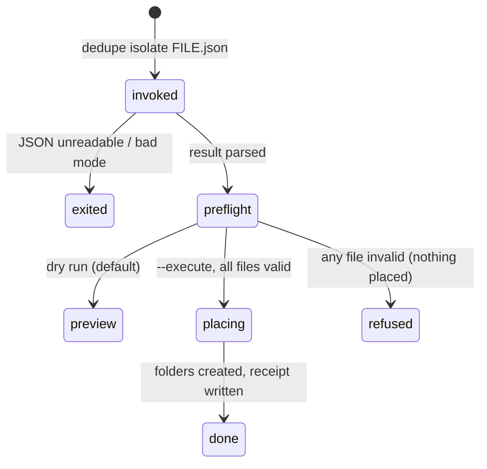

# `isolate`

## Summary

`isolate` lays out the duplicate groups from a previous scan into review folders — one subfolder per group, the suggested keeper marked with a `KEEP__` prefix — so the user can compare files side by side in Finder instead of in the browser. It is a CLI-only operation, working from a scan's `--json` output rather than rescanning, and its default mode *copies*: the originals are never touched unless the user explicitly chooses a destructive mode. The isolate action in the web UI runs the same machinery; see [Action sheet](../ui/action-sheet.md).

## The simple case

After `dedupe scan ~/Pictures --json results.json`, the user runs `dedupe isolate results.json`. By default this is a dry run: it validates every file, computes the layout, and prints what would be created under `~/Pictures/_Dedupe Review/session-{timestamp}/`. Satisfied, the user reruns with `--execute`; the folders appear, each group in its own numbered subfolder with a `KEEP__photo.jpg` marking the suggested keeper and a `_group.json` describing the group. A `_review_index.json` lists the session.

## The interaction, event by event



### Invoke

The command takes one required argument — the results JSON from `dedupe scan --json` — plus `--review-dir DIR`, `--isolate-mode copy|hardlink|symlink|move` (default `copy`), `--isolate-kinds all|exact|similar|no_humans|low_resolution|random_review` (default `all`), `--allow-cross-device`, and `--dry-run`/`--execute`. Parsing validates the mode and kinds choices; the JSON file itself is read and parsed before any checking — an unreadable or malformed file aborts with a parse error.

Unlike the `scan` command's action flags, `isolate` defaults to **dry run**: without `--execute`, nothing is created.

### Exit immediately

`--help` exits 0. A missing or malformed JSON file raises before any validation. `--isolate-mode move` against a destination on another volume is refused in preflight unless `--allow-cross-device` is set.

### Begin running

Preflight validates *every member of every group* before placing anything: each file must still exist, be a regular file (symbolic links are refused — acting on one would silently act on its target), match its scan-time identity (size, mtime, device, inode), and still be inside the scanned roots. In dry run this produces the preview; with `--execute`, one invalid file cancels the entire isolate — every item is reported failed, either with its own reason or with "isolate cancelled because another file failed preflight". Nothing is partially placed.

### While running

Placement creates the session tree:

```
{review_dir}/session-{timestamp}-{id}/
  exact/
    001_exact_image_n2_{keeper-name}_{group-id}/
      KEEP__photo.jpg
      photo_copy.jpg
      _group.json
  similar/
    001_similar_image_n2_.../
      ...
  _review_index.json
```

Folder names carry the group number, kind, media type, member count, a safe-truncated keeper name, and the group id. In `move` mode the originals are relocated; in `hardlink` mode links are created with a fallback to copy when linking fails (cross-volume); in `symlink` mode links point at resolved originals. `copy` is just `copy2` — metadata preserved, originals untouched. Placement runs on a bounded worker pool with results in input order.

### Finish

The command prints `DRY-RUN isolate: N ok, M failed` (or `EXECUTED`), the review root, the group-folder count, up to twenty folder names ("… +N more"), and the receipt path when one was written. Exit 0 when nothing failed, 1 when any item did. The default review directory is derived from the scan roots recorded in the JSON — `_Dedupe Review` inside the source, which is deliberately where Finder can see it beside the originals.

## Modifiers

| Modifier | Set at the start | Changed while extended |
| --- | --- | --- |
| `--isolate-mode` | `copy` (default, non-destructive), `hardlink`, `symlink`, or `move` (the only destructive one). | Fixed. |
| `--isolate-kinds` | Which group kinds to lay out; default all. Keep-one kinds with fewer than two members are skipped. | Fixed. |
| `--review-dir` | Overrides the default `_Dedupe Review` placement. | Fixed. |
| `--allow-cross-device` | Lets `move` cross volumes by copy-verify-unlink. Without it, cross-volume selections fail in preflight before anything is touched. | Fixed. |
| `--execute` vs default dry run | Preview only vs real placement. | Fixed. |
| stdout piped | Plain text either way. | No effect. |

## Cancel and interrupt

| Event | Before placement | While placing |
| --- | --- | --- |
| The user aborts explicitly (Ctrl+C) | Nothing was written. | Copies in flight stop mid-batch: some group folders exist, others do not; the receipt may be missing. The session's timestamp folder makes rerunning harmless — a new session folder is created, never merged. |
| The user does something else mid-way | Not applicable. | Not applicable. |
| A clean complete happens elsewhere | Not applicable. | No other isolate runs against the same command; two concurrent isolates create two separate session folders without colliding. |
| The environment fails | Preflight failures are per-file reasons in the output; one failure cancels the whole execute. | A per-file placement error (disk full, permission) fails that item; the batch continues and the exit code is 1. |
| The page or process goes away (terminal closed) | No effect. | Same as Ctrl+C. |
| Something else changes the target | Caught by preflight identity checks. | A file that changes between validation and its own placement is the same unclosed race as every action ([Actions and undo](../foundations/actions-and-undo.md#cancel-and-interrupt)). |
| The input channel changes | stdin unused; stdout closed kills the process. | Same. |
| A resumed review supersedes | No effect: isolate works from the JSON file, not a live session. | No effect. |

## Interactions with other systems

**Files on disk.** Creates the session tree and a receipt; reads the JSON. `copy`, `hardlink`, and `symlink` modes never modify originals; `move` relocates them. Full inventory in [Files Dedupe writes](../cross-cutting/caches-and-files.md).

**Safety and undo.** Dry-run default, all-or-nothing preflight, symbolic-link refusal, and per-file identity checks are the same safety family as the main actions. There is no `undo` for isolate — in copy modes nothing needs undoing; a `move` undone by hand is a Finder job.

**Review sessions.** None: the JSON file is the input, frozen at scan time.

**Optional dependencies.** None — isolate moves bytes; the JSON already holds every fingerprint.

**Concurrency and resource limits.** Placement uses a bounded worker pool; results stay ordered.

**macOS specifics.** The default `_Dedupe Review` inside the source is designed for Finder browsing; the `KEEP__` prefix sorts keepers first visually.

**Configuration and defaults.** Mode `copy`, kinds `all`, dry-run default. The review directory default is the JSON's first scan root (or their common parent) + `_Dedupe Review`.

## Edge cases

- A results JSON with zero groups completes successfully and creates an empty session envelope.
- Duplicate member names inside a group get unique destination names.
- Hardlink mode silently falls back to copy when the filesystem refuses links — the layout is identical either way.
- Running isolate twice against the same JSON produces two session folders; nothing accumulates or overwrites.
- `--isolate-kinds exact` still writes the session tree with only the `exact/` subfolder.

## Open questions and verification

- Whether the dry-run preview prints per-file placement destinations or only counts was read from the CLI's summary block; the item detail may only appear in the receipt.
- The receipt for an isolate dry run exists (like other previews) and is prunable with `--drop-previews`; confirm in [Receipts](receipts.md)'s terms.

Verified against dedupe commit `2a6cede`.
