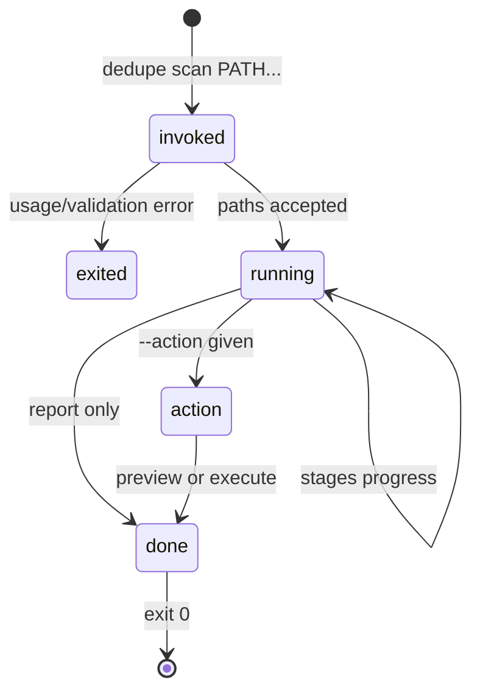

# `scan`

## Summary

`scan` runs the full [scan pipeline](../foundations/scan-pipeline.md) from a terminal: it inventories the given folders, finds duplicates and review candidates, prints a live progress line and a summary, and optionally writes the results to JSON or acts on them — with a dry-run preview as the default and an explicit `--execute` required to move anything. Running `dedupe PATH...` with no subcommand is a shortcut for `dedupe scan PATH...`. The web UI runs the same pipeline from a browser ([Scan setup](../ui/scan-setup.md)); the CLI is for scripts, headless runs, and piping results into [`isolate`](isolate.md).

## The simple case

`dedupe scan ~/Pictures` walks the folder, printing a single updating progress line — phase, counts, message — then a summary: how many files, exact and similar groups, low-resolution and random-review candidates, reclaimable space; a diagnostics block with failures, cache hits, and duration; nothing moves. Adding `--json results.json` also writes the complete result for later use. Adding `--action trash` prints what *would* move (dry-run is the default); adding `--execute` makes it real.

## The interaction, event by event

### Invoke

Arguments are parsed; every flag is listed under [Modifiers](#modifiers). One validation happens before any file is read: each enabled low-resolution megapixel bound must be positive and finite, else the command exits 2 with "low-resolution {type} megapixel bound must be positive". Paths are expanded (`~`) and resolved by the engine; missing folders and Photos libraries are reported during the walk, not at parse time. The first visible output is the progress line, overwritten in place: `phase [processed/found]: message`.

### Exit immediately

`--help` prints the subcommand help and exits 0. Argparse usage errors (unknown flag, bad choice for `--human-backend`, missing paths) exit 2 with a usage message on stderr. The low-resolution bound check above also exits 2 before scanning. No partial state is left: nothing is written until the scan completes.

### Begin running

The walk begins at once. Progress prints as one carriage-returned line — the user sees phase names in order: `starting`, `inventory`, `cache`, `processing`, `low-resolution`, `human-detection` (if enabled), `face-detection` (if enabled), `done`. The engine reports per-stage text merged into the processing line ("Exact hash 12/340 · Images hashing: 5/200"). Ctrl+C during any stage before an action is [safe to interrupt](../glossary.md): the scan raises, the process exits, and only cache writes that already happened remain.

### While running

Everything about the stages — order, thresholds, streaming order, failure tolerance — is owned by [The scan pipeline](../foundations/scan-pipeline.md). From the terminal the visible facts are: the single updating progress line; no other output until completion; and, with `--parallel`, one stream per folder with no cross-folder deduplication (groups only ever contain files from one folder).

### Finish

On completion the command prints, in order:

1. **The summary** — file and group counts per category and reclaimable bytes.
2. **A faces line** when `--count-faces` ran: files with faces, files with more than one, files analyzed.
3. **Diagnostics** — total failures across stages, cache hits, duration, then one line per stage that failed or warned, then up to ten warnings ("… +N more" beyond that).
4. **"Wrote {file}"** if `--json` was given — the full result serialized, the same format [`isolate`](isolate.md) consumes.
5. **The action block** if `--action` was set: `DRY-RUN {action}: N ok, M failed`, plus the review root and group-folder count for isolate, and the receipt path for executed trash/quarantine.
6. If `--ui` was given, the web server starts on the scan result instead of the process exiting.

Exit code is 0 whenever the command runs to completion — including scans that found nothing and actions where some files failed; failures are reported in the output, not the exit code. Exit 2 is reserved for argument and setup errors.

## Modifiers

| Modifier | Set at the start | Changed while extended |
| --- | --- | --- |
| Detection toggles: `--no-exact`, `--no-similar`, `--no-images`, `--no-gifs`, `--no-videos`, `--hidden` | Define what the scan looks at; defaults: exact and similar on, all media kinds on, hidden off. | Flags are fixed once running. |
| Review categories: `--no-low-resolution`, `--low-resolution-types`, `--low-resolution-{image,gif,video}-max-mp`, `--random-review-count N`, `--find-no-person`, `--count-faces` | Enable/disable each category; low-res defaults to 1.0 MP for all three types; random defaults to 50 (0 disables); no-person and faces off. | Fixed once running. |
| Thresholds: `--threshold N` (image, default 6), `--video-threshold N` (default 8) | Comparison strictness per [Scan pipeline](../foundations/scan-pipeline.md#how-each-detection-works). | Fixed. |
| Person detection: `--human-backend opencv\|photon\|ensemble`, `--photon-model MODEL` | Backend choice; photon's first use can download ~10 GB of weights. | Fixed. |
| Exclusions: `--exclude GLOB` (repeatable) | Remove matching paths from the walk. | Fixed. |
| Performance: `--workers N` (0 = auto), `--parallel`, `--max-streams N`, `--no-cache` | Auto workers are conservative and stage-capped ([Scan pipeline](../foundations/scan-pipeline.md#interactions-with-other-systems)); `--parallel` scans each folder as its own stream. | Fixed. |
| Output: `--json FILE`, `--smart RULE` | JSON result file; the smart rule applied to every group before acting (default `automatic`). | Fixed. |
| Action: `--action none\|trash\|quarantine\|isolate` with `--dry-run` (default) / `--execute`, `--quarantine-dir`, `--review-dir`, `--isolate-mode`, `--isolate-kinds`, `--allow-cross-device`, `--ui`, `--port` | What happens after the scan; dry-run previews unless `--execute`. | Fixed. |
| stdout is a pipe | The progress line still prints carriage returns — scripts see them as one long line; the summary is plain text on either. | No effect. |

Selections in the CLI are made by the `--smart` rule alone — there is no interactive selection; users who want to choose per group use the web UI.

## Cancel and interrupt

| Event | Before running | While running |
| --- | --- | --- |
| The user aborts explicitly (Ctrl+C) | Nothing started. | The first Ctrl+C asks the engine to stop at its next checkpoint — the same cooperative cancel the web UI's Cancel button uses: it prints "Cancelling after the current work item… (Ctrl+C again to stop now)", stops at the next work-item boundary, prints `scan cancelled` on stderr, and exits 130. A second Ctrl+C stops immediately (plain `cancelled`, also 130). Safe throughout scanning: only cache writes may have happened. During an `--execute` action, Ctrl+C interrupts mid-batch: files already moved stay moved, and the receipt may be incomplete. |
| The user does something else mid-way | Not applicable; the invocation owns the terminal. | Not applicable. |
| A clean complete happens elsewhere | Not applicable. | Another `dedupe` run in another terminal is independent; the hash cache tolerates concurrent readers via its connection handling, but two scans writing the same cache concurrently is not a supported pattern. |
| The environment fails | A bad low-res bound exits 2 before scanning. | Corrupt files never abort the scan ([Scan pipeline](../foundations/scan-pipeline.md#cancellation-and-failure)); per-stage failures land in the diagnostics block. |
| The page or process goes away (terminal closed) | No effect. | SIGHUP kills the run like Ctrl+C; mid-action leaves the same partial state. |
| Something else changes the target | Files are read as the walk reaches them. | Changed files simply scan in their new state; the CLI has no later revalidation unless an action runs, whose preflight catches staleness ([Actions and undo](../foundations/actions-and-undo.md)). |
| The input channel changes (stdin/stdout closed) | stdin is never read. A closed stdout breaks the progress prints and the process dies with a broken pipe. | Same; nothing committed but cache writes. |
| A resumed review supersedes | No effect: the CLI writes no review session. | No effect. |

## Interactions with other systems

**Files on disk.** The scan writes the hash cache (unless `--no-cache`) and the `--json` file if requested; executed actions write receipts; isolate creates its `_Dedupe Review` tree. The CLI never writes the review session file — that belongs to the web UI.

**Safety and undo.** `--action` runs the identical safety model as the UI: effective selection from the `--smart` rule, preflight, keeper protection, immediate revalidation, receipt. Dry-run is the default; `--execute` is the only way to move files.

**Review sessions.** None. A CLI scan leaves no resumable state; its JSON output is the artifact for later [`isolate`](isolate.md) runs.

**Optional dependencies.** Missing ffmpeg skips video similarity with a diagnostic warning; missing OpenCV empties the person/face categories (fail-closed for Non-Human). See [Optional dependencies](../cross-cutting/optional-dependencies.md).

**Concurrency and resource limits.** `--workers` feeds the same auto-and-cap logic as the UI; `--parallel` splits per folder and `--max-streams` bounds how many run at once.

**macOS specifics.** Photos.app library roots are refused with an export message; Trash goes through the system trash.

**Configuration and defaults.** All defaults are the flag defaults listed above; there is no config file.

## Edge cases

- `dedupe ~/Pictures` (bare path) is the same scan; the shortcut only fires when the first argument is not a known subcommand and does not start with `-`.
- `--smart deselect_all` with `--action trash --execute` scans, selects nothing, and the action block reports 0 ok — a harmless no-op.
- `--action quarantine` without `--quarantine-dir` exits 2 with "error: --quarantine-dir required for quarantine" — before any action work.
- The progress line overwrites itself with `\r`; redirecting output to a file captures every intermediate state on one line each.
- A scan that found no media still prints its summary and diagnostics and exits 0.

## Open questions and verification

- (Resolved 2026-09-03.) The CLI's Ctrl+C now uses the engine's cooperative cancel: the first press stops at the next checkpoint ("Cancelling after the current work item…"), a second press interrupts immediately. The fix also closed a stage-pool deadlock where a cancelled dimensions stage never released the review stage, hanging the process — the web UI's Cancel had the same exposure.
- The summary format comes from `summarize_scan` in `actions.py`; its exact lines were not reproduced here verbatim.
- `--ui` after an executed action serves the post-action result; the interplay with the review session save on UI startup was not exercised.

Verified against dedupe commit `2a6cede`.
