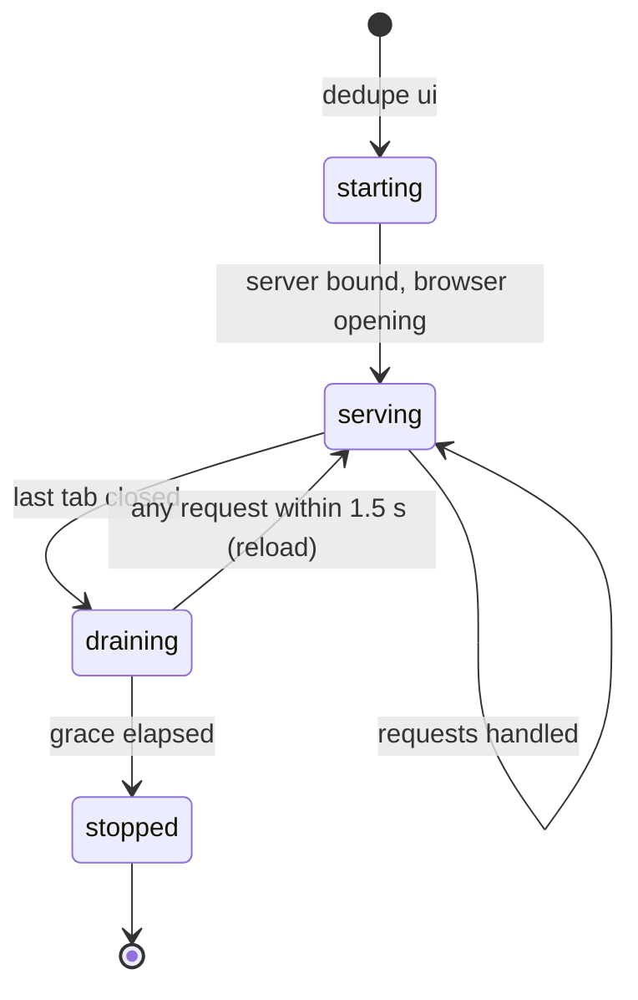

# `ui`

## Summary

`ui` starts the local web server and hands the rest of the experience to the browser: it prints the URL, opens the default browser, and then keeps running quietly until the last browser tab closes — at which point it stops itself. It is how most users meet Dedupe, and on macOS also via double-clicking `Dedupe.command`. Everything that happens in the browser is owned by the `ui/` documents, starting with [Scan setup](../ui/scan-setup.md).

## The simple case

`dedupe ui` prints `Dedupe UI: http://127.0.0.1:8765/`, opens the browser to it about a second later, and prints `Press CTRL+C to quit (closing the browser tab also stops the server)`. The user reviews in the browser. When they close the tab, the server notices, waits a moment and a half for a possible reload, and exits on its own — the terminal (or the Terminal window opened by the launcher) is done.

## The interaction, event by event

### Invoke

The parser accepts `--port N` (default 8765), `--no-browser`, and `--load JSON` (a previous scan's results file, as written by `dedupe scan --json`). With `--load`, the app starts with those results already installed — the user lands on the group list, not an empty setup, and the status line reads "Loaded previous scan". Without it, the app starts with whatever [saved review session](../foundations/review-session.md) exists, or an empty setup.

### Exit immediately

`--help` prints the subcommand help. A port already in use fails at server bind time; the process reports the OSError and exits — the user sees a traceback rather than a friendly "port busy" message.

### Begin running

The server binds to `127.0.0.1` only — the loopback address; nothing on the network can reach it. The browser is opened by a timer 0.8 seconds after startup so the server is ready when the page arrives. The terminal shows the two lines above and then nothing unless the request log is enabled.

### While running

The server serves the page, the API, thumbnails, and media streams; every interaction in the `ui/` documents happens against it. All state lives in this process: scan results, selections, preview tokens, the trash map for per-candidate restores. The process does not fork or daemonize; the terminal stays attached, and Ctrl+C is the manual stop.

### Finish

The server stops three ways:

1. **The tab closes.** The page sends a shutdown notice when it hides; the server waits **1.5 seconds** and then shuts down cleanly. Any request arriving in that window — the page reloading, another tab opening — cancels the shutdown, so a quick reload does not kill the session.
2. **Ctrl+C.** Immediate, server-side equivalent.
3. **Being killed.** State not in the session file is lost, as with any crash.

The exit is clean: the launcher's Terminal window closes with the process.

## Modifiers

| Modifier | Set at the start | Changed while extended |
| --- | --- | --- |
| `--port N` | Which local port serves; nothing else changes. | Fixed. |
| `--no-browser` | The URL prints but no browser opens; the user navigates there themselves. | Fixed. |
| `--load JSON` | Installs a previous scan result as the starting state. | Fixed. |
| stdout is a pipe | The two startup lines still print; nothing is colorized or interactive. | No effect. |

## Cancel and interrupt

| Event | Before serving | While serving |
| --- | --- | --- |
| The user aborts explicitly (Ctrl+C) | The process dies before binding. | The server stops at once; in-flight requests die; state not saved to the session file is lost. |
| The user does something else mid-way | Not applicable. | The server exists to be used from the browser; multiple tabs share one server and one state, and the shutdown waits for the *last* tab. |
| A clean complete happens elsewhere | Not applicable. | A completed action or scan is state the server holds; nothing else runs alongside. |
| The environment fails | A busy port exits with an error at startup. | Server-side errors surface in the browser as error payloads; the process keeps serving. |
| The page or process goes away | No effect. | Closing the last tab triggers the graceful self-shutdown described above; killing the process loses in-memory state (preview tokens, an unsaved scan, any change in flight). |
| Something else changes the target | No effect. | File changes are handled by revalidation at action time, not by the server itself. |
| The input channel changes | stdin is never read. Closing the terminal sends SIGHUP and the process dies. | Same. |
| A resumed review supersedes | That is the startup behavior with a saved session. | Resume is a browser-side operation against this server. |

## Interactions with other systems

**Files on disk.** Serving itself writes nothing; the scans and actions performed through it write what their own documents describe. The launcher writes nothing either.

**Safety and undo.** None directly; the safety model lives in the actions the browser confirms.

**Review sessions.** A saved session auto-loads at startup; a completed scan saves one. See [Session resume](../ui/session-resume.md).

**Optional dependencies.** The server imports flask — a required package; `dedupe doctor` reports it. Detection dependencies affect scans, not serving.

**Concurrency and resource limits.** The server is threaded; one global lock serializes scans and actions against each other. Several open tabs are supported and share the same state — including shutting the server down when the last one closes.

**macOS specifics.** `Dedupe.command` (repo root or `launchers/`) double-clicks into the same `ui` startup inside a Terminal window, opens the browser, and the window closes itself when the tab does.

**Configuration and defaults.** Port 8765, loopback only, browser auto-open on. The API carries a version number the launcher uses to avoid pairing stale processes with new static files.

## Edge cases

- Closing the tab and reopening within 1.5 s continues the same session seamlessly; the shutdown timer is cancelled by the first request of the reloaded page.
- Two `dedupe ui` processes cannot share the port; the second fails to bind.
- With `--load` and a saved session both present, the loaded JSON wins the startup state; the session file is then overwritten with it on the first save.
- The browser-opening timer can race a very slow browser; the page simply retries against an already-listening server.
- Requests from other machines are impossible by binding (loopback), and cross-origin requests from other local pages are rejected by the token and origin checks.

## Open questions and verification

- The busy-port failure mode (traceback vs message) was read from the make_server path, not reproduced.
- What the Terminal window shows between startup and shutdown when launched via `Dedupe.command` (request log visibility) was not observed by hand.
- Whether a second tab closing before the first ever existed still schedules shutdown (it should — the notice fires per pagehide) is to confirm during verification.

Verified against dedupe commit `2a6cede`.
