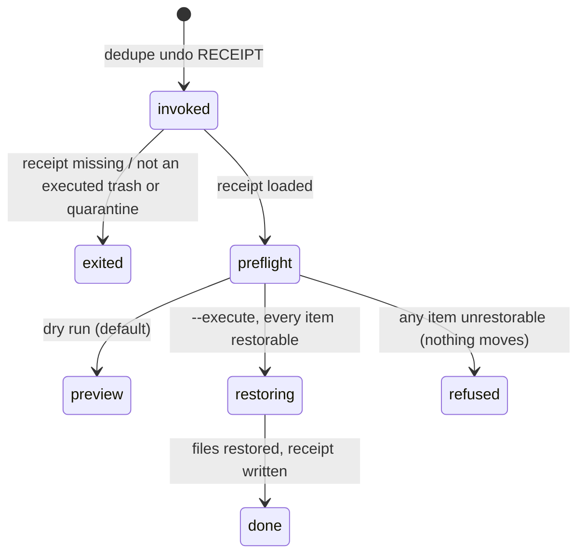

# `undo`

## Summary

`undo` restores a completed trash or quarantine action: it reads the action's receipt and moves every successfully moved file back to its original path — from the quarantine folder, or from the Trash destination recorded when the file was sent there. It is the recovery half of both actions ([Actions and undo](../foundations/actions-and-undo.md#undo)), it is all-or-nothing, and like every destructive command it defaults to a dry-run preview. A trashed file whose Trash destination was never recorded can only come back through Finder; its presence on a receipt refuses the whole undo.

## The simple case

`dedupe receipts list --undoable` shows which receipts can be undone. `dedupe undo {receipt-id}` previews the restore: each quarantined file and the path it will return to, without moving anything. `dedupe undo {receipt-id} --execute` performs it, in reverse of the original order, and writes a receipt for the undo itself.

## The interaction, event by event

### Invoke

The argument is a receipt id (as printed by `dedupe receipts list`) or a path to a receipt JSON; `--log-dir DIR` points id resolution at another receipts directory (default `~/.cache/dedupe/logs`). `--execute` performs the restore; without it the command is a preview. Loading rejects anything that is not an *executed trash or quarantine* receipt — dry-run previews, isolate receipts, and undo receipts all fail with an error and exit 2.

### Exit immediately

A missing receipt, an unknown id, or a disqualified receipt exits 2 with `error: …` on stderr. The preview of a valid receipt prints `DRY-RUN undo: N ok, M failed` and per-item failures, and exits 0 or 1 accordingly without moving anything.

### Begin running

The preflight checks every item before any move: the moved file must still exist at its recorded destination (for a trash receipt, a bare "Trash" marker instead of a real path fails with "trash destination was not recorded; restore this one in Finder"), and the original path must be unoccupied — a file (or a symbolic link) now living where the original was refuses that item with "original path is already occupied".

### While running

If any item failed preflight, the whole restore is refused: every other item is reported as "undo cancelled because another item failed preflight" and nothing moves. Otherwise each moved file is moved back to its original path, processing the receipt's items in reverse order. Restores always may cross volumes — a quarantine folder or a volume's Trash may legitimately live on another disk — and the original's parent directories are recreated if they no longer exist.

### Finish

`EXECUTED undo: N ok, M failed`, one line per failed item, and the new receipt's path. Exit 0 when nothing failed, 1 otherwise. The undo receipt records the reverse moves, so the history reads action → undo in `dedupe receipts list`.

## Modifiers

| Modifier | Set at the start | Changed while extended |
| --- | --- | --- |
| `--execute` vs default dry run | Preview vs restore. | Fixed. |
| `--log-dir DIR` | Where ids resolve; the undo receipt is written beside the source receipt by default. | Fixed. |
| stdout piped | Plain text either way. | No effect. |

## Cancel and interrupt

| Event | Before restoring | While restoring |
| --- | --- | --- |
| The user aborts explicitly (Ctrl+C) | Nothing moved. | Some files restored, others still moved away; the receipt is written at the end, so an interrupted undo may leave no record. Rerunning the original receipt continues sensibly: already-restored items now fail preflight ("moved file no longer exists at its recorded destination") and the rest are refused — recovery then proceeds file by file by hand. |
| The user does something else mid-way | Not applicable. | Not applicable. |
| A clean complete happens elsewhere | Not applicable. | No concurrent restores of the same receipt are coordinated; running two at once would race on the same files. |
| The environment fails | Preflight reports the reason per item. | A per-file move error (permissions, disk) fails that item and the exit code is 1; the rest continue. |
| The page or process goes away (terminal closed) | No effect. | Same as Ctrl+C. |
| Something else changes the target | Occupied original paths are caught by preflight. | A path that becomes occupied between preflight and its own move is the unclosed race; the move fails and is reported. |
| The input channel changes | stdin unused. | No effect. |
| A resumed review supersedes | No effect: undo works from a receipt file, not a live session. | No effect. |

## Interactions with other systems

**Files on disk.** Moves quarantined or trashed files back; recreates missing parent directories; writes one receipt. No cache or session file is touched.

**Safety and undo.** This *is* the undo half of the safety model; its all-or-nothing preflight is described in [Actions and undo](../foundations/actions-and-undo.md#undo).

**Review sessions.** None directly; a live review that already dropped the moved files stays as it is — restored files reappear on the next scan. A live review that still lists the files is likewise unaffected — its next preflight will see them as missing.

**Optional dependencies.** None.

**Concurrency and resource limits.** Restores run serially; the item count is bounded by the original action.

**macOS specifics.** None beyond ordinary file moves.

**Configuration and defaults.** Receipts directory `~/.cache/dedupe/logs` unless `--log-dir` overrides.

## Edge cases

- Undoing an already-undone receipt reports every item as missing from its recorded destination and does nothing (exit 1).
- Items that originally failed are skipped silently — only successfully moved items are candidates for restore.
- An original path now occupied by a *symbolic link* also refuses; the check treats links as occupied.
- Ids and paths are interchangeable in the argument; an absolute path bypasses `--log-dir` entirely.

## Open questions and verification

- The mid-undo Ctrl+C recovery path (rerun reports "no longer exists" and refuses the rest) is inferred from the preflight logic, not reproduced — reproducing it safely needs a disposable quarantine.
- Whether the undo receipt's action label (`undo:trash` / `undo:quarantine`) appears verbatim in `receipts list` output is to confirm while verifying [Receipts](receipts.md).

Verified against dedupe commit `2a6cede`.
