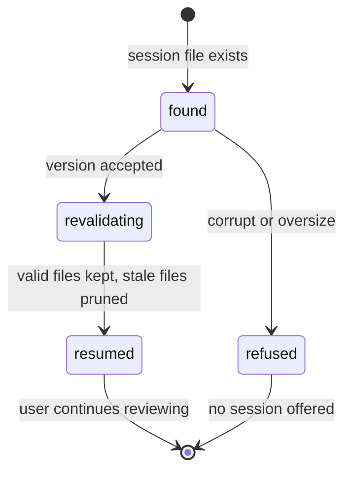

# The review session

## Summary

The review session is how a finished review survives an app restart. When a scan completes, its results — files, groups, selections, reviewed paths, and the destinations of any trashed review candidates — are saved to a single JSON file; the next time the app starts, the session is offered back, every file in it is revalidated against the disk, anything that no longer matches is pruned, and the user resumes where they left off. This document owns the save format's guarantees, the pruning rules and their reasons, and what *resume* commits to. The banner the user actually sees is [Session resume](../ui/session-resume.md); what can be done with the resumed selections is [Actions and undo](actions-and-undo.md).

## The simple case

The user scans, reviews some groups, and quits the app (or the machine restarts, or the server is stopped). The scan result was saved atomically the moment the scan finished, and saved again whenever selections changed enough to persist. On the next start, the app finds the session file, checks every file it mentions, drops the ones that changed or vanished, and shows the resumed review with a banner reporting what was dropped and why. The user continues reviewing; a confirmed action works exactly as it would have before the restart.

## Where the session lives

The session file is `~/.local/state/dedupe/review-session.json` (honoring `XDG_STATE_HOME`). It is written with private permissions — `0600` for the file, `0700` for its directory — because it contains a full inventory of the user's media paths. The write is atomic: the new session is written to a temporary file in the same directory, synced to disk, and renamed over the old one, so a crash in the middle of saving leaves either the old session or the new one, never a torn file. A session larger than 64 MB is refused at load time rather than parsed.

## What a resume does, event by event

### Loading

The file is read and its version checked (currently version 1; anything else is reported as corrupt, not guessed at). A file that cannot be parsed — truncated, hand-edited, wrong shape — is reported as corrupt with its error; the app starts clean and the file is left alone for inspection.

### Revalidating

Every file the session mentions — the scan's file list *and* every group member — is checked with a single metadata read:

- it still exists and is a regular file, not a symbolic link;
- it is still inside one of the scanned folders;
- its size, device, inode, and modification time all match the scan's snapshot.

A file that fails any check is pruned. The five reasons, exactly as the banner labels them: **no longer on disk**, **changed since the scan**, **outside the scanned folders**, **became a symbolic link**, **could not be read**.

One exemption: a file whose path appears in the session's trash map — a review candidate trashed during the session — is absent from its original path *on purpose*, so it is kept without being checked, and its per-candidate undo survives the restart with it ([No-person review](../ui/no-person-review.md#while-extended)).

### Pruning

Pruning removes the file from the inventory, from every group that contained it, and from every selection and reviewed list that named it. Groups shrink accordingly, with two survival rules: a keep-one group needs at least two members to remain a group (one survivor is nothing to deduplicate); an independent group survives with one. If a group's suggested keeper was pruned, the first remaining member becomes the new suggestion. If anything was pruned, the shrunken session is saved back immediately, so a later resume never re-reports the same drops.

The banner reports the total pruned count per reason, plus up to **20 example files** with their reasons in a "What was dropped?" list.

### Resuming

What remains is installed as the current scan result exactly as if it had just been scanned: the same groups, the same selections, the same review categories. The difference the user should feel is trust: everything that survived revalidation matched the disk a moment ago, and everything is revalidated *again* immediately before any action (see [Actions and undo](actions-and-undo.md#the-safety-model)).

## Cancel and interrupt

| Event | Before resume | During resume |
| --- | --- | --- |
| The user aborts explicitly | *Discard saved review* deletes the session file before resuming; the app starts clean. | Resume itself cannot be cancelled; it is a load-time step that finishes before the UI is interactive. |
| The user does something else mid-way | A new scan replaces the current result; the session file is overwritten with the new scan when it completes. | No effect: resume completes first. |
| A clean complete happens elsewhere | No effect. | No effect. |
| The environment fails | An unreadable session file is reported as corrupt; the app starts without a session. | A file that cannot be stat'ed during revalidation is pruned as "could not be read" — the resume continues. |
| The page or process goes away | The session file is whatever was last saved; selections made since the last save are lost. | A crash mid-resume leaves the old session file (the save-back is atomic); the next start repeats the same prune. |
| Something else changes the target | That is the whole point of revalidation: files changed since the save are pruned, not acted on. | Same. |
| The input channel changes | No effect. | No effect. |
| A resumed review supersedes | No effect. | No effect — this *is* the resumption. |

## Interactions with other systems

**Files on disk.** One file: the session JSON. Safe to delete by hand — the app then starts clean. Listed in [Files Dedupe writes](../cross-cutting/caches-and-files.md).

**Safety and undo.** Resuming never moves or deletes anything; it only restores state. Every safety rule of [Actions and undo](actions-and-undo.md) applies unchanged to resumed selections.

**Review sessions.** (This document.)

**Optional dependencies.** None: revalidation reads file metadata only; no decoding or hashing happens at resume time.

**Concurrency and resource limits.** Revalidation is a single-threaded metadata pass over the session's files; for a very large session it is the slowest part of startup, bounded by the 64 MB session cap.

**macOS specifics.** Files evicted by iCloud (present in the folder but not on disk in full) fail the readability check and are pruned like any missing file.

**Configuration and defaults.** The path respects `XDG_STATE_HOME`; nothing else is configurable. There is no setting to disable saving — every completed scan saves.

## Edge cases

- A session saved by a newer version of Dedupe (version number greater than 1) is refused as unsupported, not migrated or partially read.
- A group that loses members in pruning keeps its original id; selections stored against that id still apply to the survivors.
- Pruning can collapse a keep-one group to a single file, which then disappears entirely — a lone survivor is not a duplicate.
- The same file pruned from three groups counts once in the banner's total.
- If the session file exists but the scan it describes had zero groups, the app resumes an empty result rather than starting blank.

## Open questions and verification

- The cadence of selection saving during review (after every change, or debounced) is visible only in the web server's persist calls; to be confirmed while writing [Group list](../ui/group-list.md).
- Whether a corrupt session file is surfaced to the user in the UI or only in logs is to be confirmed in [Session resume](../ui/session-resume.md).

Verified against dedupe commit `2a6cede`.
