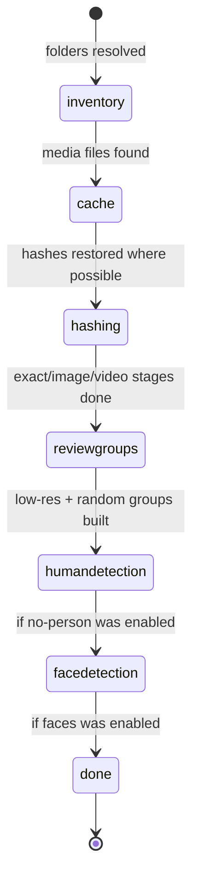

# The scan pipeline

## Summary

A scan is one full pass over a set of folders: it finds every media file, fingerprints them, and turns the fingerprints into review groups — exact duplicates, similar images and videos, low-resolution candidates, a random review sample, and optionally no-person and faces candidates. This document owns the order of the stages, every detection threshold, and the rules for what counts as a media file; the experience of starting and watching a scan lives in [Scan setup](../ui/scan-setup.md) (web UI) and [`scan`](../cli/scan.md) (CLI).

## What a scan examines

A scan walks the given folders recursively and picks up three kinds of media by file extension:

- **Images:** `.jpg`, `.jpeg`, `.png`, `.heic`, `.heif`, `.webp`, `.avif`, `.tif`, `.tiff`, `.bmp`, `.raw`, `.cr2`, `.nef`, `.arw`, `.dng`
- **GIFs:** `.gif`
- **Videos:** `.mp4`, `.mov`, `.m4v`, `.avi`, `.mkv`, `.webm`, `.mts`, `.m2ts`, `.wmv`, `.flv`, `.3gp`, `.mpg`, `.mpeg`, `.ts`, `.vob`

AVIF files render natively in the browser, so they need no transcode anywhere. Like the other formats browsers cannot play natively (`.avi`, `.mkv`, `.wmv`, `.flv`, `.mts`, `.m2ts`), the MPEG-1/2 containers (`.mpg`, `.mpeg`, `.ts`, `.vob`) fingerprint and thumbnail normally but the lightbox's video player may not play them; their cards still show a poster frame.

Everything else is ignored silently. Hidden files are skipped unless the scan is told to include them. Each kind can be turned off for a scan (`include_images`, `include_gifs`, `include_videos`), and exclusion globs remove matching paths before anything is read.

Before walking begins, each folder path is expanded (`~` allowed), resolved, and checked. A missing folder produces an error and is skipped rather than aborting the scan. A folder inside a Photos.app library is refused with a message telling the user to export media from Photos first; Photos libraries are never scanned directly.

## The stages, in order

1. **Inventory.** Walk the folders, count files matching the enabled media kinds. The progress line shows files found so far.
2. **Cache hydration.** The [hash cache](../cross-cutting/caches-and-files.md) is consulted; every file whose size and modification time match a cached entry gets its stored hashes back without re-reading the file. The progress line shows hits out of total. If the cache cannot be opened, the scan continues without it and says so.
3. **Hashing — three stages at once.** Exact duplicate detection, image/GIF similarity hashing, and video fingerprinting all run concurrently, because they touch disjoint file sets and different kinds of work (disk reads, CPU decoding, ffmpeg subprocesses). Groups are *published* in a fixed order: all exact groups before any similar group, because similar grouping consults which files are already exact duplicates. The expensive hashing never waits; only the publishing does. Progress from all three merges into one combined count and ETA.
4. **Low-resolution dimensions.** Files that still lack dimensions are probed (cheap header reads for images, ffprobe for videos) so low-resolution suggestions can be made. This stage exists only when low-resolution review is enabled, which it is by default.
5. **Review groups.** Low-resolution groups (skipping files with a durable [Keep decision](../glossary.md)) and the random review sample are built and streamed to the UI.
6. **Person detection** (only when the no-person review was requested). Every file is analyzed for people using the chosen [backend](../glossary.md); the default is OpenCV.
7. **Face detection** (only when faces review was requested). Face counting plus gender classification run on images, GIFs, and videos using OpenCV.

After the last stage, everything the scan learned is written back to the hash cache, and the final result — files, groups, errors, and per-stage diagnostics — is assembled.

## How each detection works

**Exact duplicates.** Files are bucketed by size; a file whose size is unique cannot be an exact duplicate and is skipped. Within a bucket, the first 64 KiB of each file is hashed; only files whose partial hashes match go on to a full SHA-256 of the whole file. For files at or below 64 KiB, the first pass already covers every byte, so its digest is reused without reading the file again. Files with matching full hashes form an exact group. Larger files that share a prefix but differ later do not match.

**Similar images and GIFs.** Each image is downscaled to at most 512 px per side and hashed twice (pHash and dHash). Candidate pairs whose global hashes are close enough are then checked with a *regional tile* comparison: the image is divided into tiles and each tile hashed, which rejects many photos that differ by pose or composition. A final color and detail comparison rejects differences the grayscale hashes miss. A pair must pass every check:

| Check | Default |
| --- | --- |
| Global image pHash | ≤ 6 |
| Candidate pairing dHash | ≤ 10 |
| Aspect-ratio agreement | ≥ 95% |
| Tile pHash, worst tile | ≤ 8 |
| Tile pHash, mean | ≤ 5.0 |
| Color, each RGB channel of a 128 px thumbnail | Mean absolute difference ≤ 32 on a 0–255 scale |
| Dense detail, worst 16×16 grayscale block of a 128 px thumbnail | Reject when the block's mean absolute difference > 3.0 **and** worst/mean > 8× |

Pairs that pass the tile check get one final comparison using 128 px thumbnails. A large average difference in any color channel rejects the pair, even when its grayscale hashes are identical. This catches different-colored images and large global changes; it still allows the tested re-exports and moderate exposure edits. The grayscale detail check compares an 8×8 grid and rejects a pair when a single block differs strongly *and* that spike dominates the overall difference — the signature of a burst shot (a blink, a shifted hand) on top of an otherwise identical frame. If either thumbnail cannot be read, the pair is not grouped, even when cached hashes agree. This verification also runs on cached scans.

**Rotated and mirrored copies.** A still image whose pixels were turned — rotated 90° or 180°, or mirrored, as happens when an app drops or ignores the EXIF orientation tag, or when a front-camera shot is exported mirrored — is found as a similar copy of its source. Candidate lookup also tries each of the seven other orientations of every still, and a turned pair must then pass the same tile, color, and dense-detail checks in the matched orientation (the dHash check applies upright only). Each pair is verified at most once turned, in the orientation whose pHash agrees best. The group's member card and the swipe deck name the turn ("rotated 90°", "rotated 180°", "mirrored", "flipped upside down", "rotated and mirrored"), and the similarity score is measured in that orientation. Files whose turn is recorded only in the EXIF tag need none of this; they are decoded upright. Animations are only compared upright. Stills cached by an earlier version are read once more on the next scan to add their turned fingerprints; if that read fails, their cached fingerprints are kept and they are only found upright.

> Technical note: candidate lookup splits each 64-bit pHash into seven chunks; two hashes within 6 bits agree exactly on at least one chunk, so candidates come from seven dictionary lookups instead of a BK-tree walk. Searching eight orientations this way costs less than searching one did with the BK-tree.

Animations use the first frame to find candidates, then compare regional detail at eight positions in playback time. Frame order matters: differences at those sampled positions can reject animations with the same opening frame. The color and dense checks compare first frames only. Equivalent exports can still match when their frame counts differ. Old animation fingerprints are refreshed on the next scan.

Groups are built around the best-ranked member (see [Duplicate group](duplicate-group.md)), never by chaining fuzzy matches transitively. Pairs the user previously marked *distinct* are never regrouped while the decision is current — the matcher and the clustering pass both consult the recorded pairs, which follow the files through renames and metadata-only drift via their perceptual content identity and lapse only on a real content change.

**Similar videos.** Each video is fingerprinted by sampling up to **8** positions along its timeline and hashing one small grayscale frame per position, extracted with direct ffmpeg seeks rather than decoding the whole timeline. Two videos are similar when their fingerprints agree at normalized positions within a mean Hamming distance of **8**, no aligned frame distance exceeds **16** at the default threshold, and the shorter duration is at least **90%** of the longer when both are known. Audio is not compared. A failed fingerprint extraction is reported in diagnostics, and a failed refresh cannot reuse an older fingerprint to form a group. Videos require ffmpeg; without it the stage is skipped with a warning in the diagnostics.

**Low resolution.** A file is a low-resolution candidate when its display dimensions are below a megapixel bound — **1,000,000 pixels** by default, configurable per media type. Candidates are unselected until reviewed; reviewing one and leaving it unselected stores a durable [Keep decision](../glossary.md) so future scans stop resurfacing it.

**Random review.** A fresh, unique sample of up to **50** scanned images, GIFs, and videos, for spot-checking the scan's judgment. The count is configurable down to zero.

**No person.** Offline person detection on images, up to 16 GIF frames, and up to 16 directly-seeked video frames, with early exit on positive evidence. Video frames are extracted in chunks of four per ffmpeg process (at most four processes per video) instead of one process per frame. Backends: `opencv` (default; bundled YuNet face model first at a recall-first 0.35 presence threshold, with a 320 px close-up scale, a mirrored pass, and 2×2 overlapping tiles, then INRIA and Daimler full-body HOG), `photon` (opt-in, roughly 10 GB model download on first use; queries woman / girl / person / face), `ensemble` (OpenCV first, Photon on uncertain frames). Photon and ensemble no-person piles are re-checked with YuNet + genderage; any counted face, especially a female face, is kept. When face counting is also enabled, Non-Human groups are built after those counts land so the same veto applies. The review is conservative and fails closed: if the YuNet model is missing, corrupt, or cannot start, no media is surfaced as Non-Human. Photo detail is retained for the tiled face checks so small, distant faces are not lost by shrinking the whole photo first. Older no-person decisions are re-analyzed on the next scan; manual human confirmations remain in force. See [No-person review](../ui/no-person-review.md).

**Faces.** OpenCV counts faces (and classifies them male/female) in images, GIF frames, and duration-scaled 4–16 sampled video frames (about one frame per five seconds, extracted in a single ffmpeg pass). Images already at or below the second detection pass's 480 px scale skip that redundant pass. Files with at least one face become faces candidates, ordered by face count. Face counting is heuristic and can miscount; the UI says so where deletion is offered.

## One pool vs parallel streams

A scan over several folders can run two ways:

- **One pool (CLI default).** All folders merge into a single inventory; duplicates are found *across* folders.
- **Parallel streams.** Each folder runs its own complete pipeline at the same time. There is no cross-folder deduplication: a group contains files from exactly one folder, and every group carries its source folder. The UI scans this way when parallel streams are requested; per-folder progress is shown separately plus one aggregate line. Low-resolution and random groups are still built over the combined result at the end.

## Streaming and progress

Groups stream to the UI the moment each one is finalized — the sidebar fills in during the scan rather than all at once at the end. The group list stays sorted with the most reclaimable space first. Progress reports include the current phase, files found and processed, groups found, elapsed time, and an ETA computed from the current phase's rate. The final message summarizes counts per category.

## Cancellation and failure

Cancellation is checked between stages and inside every worker pool; a cancelled scan stops with phase `cancelled`, keeps whatever groups were already published, and writes nothing further — except the hash cache: the work each stage completed before the cancel is persisted as the cancel propagates, so a rerun reuses it. A scan is [safe to interrupt](../glossary.md) until an action runs against its results.

A single corrupt or unreadable file never aborts the scan; this is deliberate, because media libraries always contain damaged files. Each failure is recorded on the file's record and summarized per stage in the result's diagnostics (attempted, succeeded, failed, skipped, duration, up to ten warnings per stage). Missing ffmpeg downgrades the video stage to a warning; an unavailable cache downgrades to running without one. Root-level problems (missing folder, Photos library) are reported as errors in the result.

## Interactions with other systems

**Files on disk.** The scan reads media files but never modifies them. It reads and writes only the hash cache; see [Files Dedupe writes](../cross-cutting/caches-and-files.md).

**Safety and undo.** None directly — scans propose, [actions](actions-and-undo.md) dispose. Nothing about a scan moves or deletes anything.

**Review sessions.** A scan's results are what a [review session](review-session.md) stores selections against; a new scan replaces the previous results.

**Optional dependencies.** ffmpeg/ffprobe are required for video similarity and video dimension probes; OpenCV for the no-person and faces reviews; Photon only when chosen as a backend. Degraded behavior per dependency is collected in [Optional dependencies](../cross-cutting/optional-dependencies.md).

**Concurrency and resource limits.** Worker counts default to "auto": one fewer than the CPU count (all cores on 2-core machines), capped at 8 overall, with per-stage caps — 4 for exact hashing, 6 for image hashing, 4 for video fingerprinting, 4 for OpenCV detection. Photon runs serially. Explicit worker settings are honored, then clamped to the stage cap.

**macOS specifics.** Photos.app libraries are detected and refused at root validation. HEIC/HEIF are first-class image types.

**Configuration and defaults.** The global image and video hash thresholds and the low-resolution pixel bounds are configurable per scan. The secondary dHash, tile, color, and dense-detail checks use internal defaults; they are not separate scan controls. The values in this document are the defaults and the ones the rest of the documentation refers to.

## Edge cases

- Scanning the same folder twice reuses the cache: unchanged files are not re-hashed, so the second scan is dominated by the inventory walk.
- A same-size file with a different prefix exits the exact funnel after the 64 KiB partial hash. Matching prefixes on larger files still require a full SHA-256; a matching prefix alone never proves an exact duplicate.
- Zero-byte files are excluded from exact candidacy (`size > 0` is required).
- Similarity requires at least two eligible files of a kind; a single image or video is never compared against itself.
- In parallel-stream mode a duplicate that exists once in each of two folders is not reported; users wanting cross-folder deduplication must scan the parent folder as one pool.
- A scan of a folder with no media files completes successfully with zero groups.
- Exclusion patterns are matched during the walk; an excluded folder's contents are never opened.

## Open questions and verification

- The exact worker caps and auto formula are read from `parallel.py`, not confirmed by measuring a real scan's core usage.
- Whether the UI exposes the one-pool mode at all, or always uses parallel streams for multiple folders, is confirmed in `ui/scan-setup.md` when written.
- The dHash pairing threshold (10) is internal to candidate generation; users only ever set the global threshold (6/8). Whether the UI should surface the distinction is a product question.
- The color limit is verified against generated color collisions, the checked-in photo fixture's re-exports, and moderate exposure changes, not a labeled sample of a user's full library. Strong edits can intentionally stop matching.
- Video fingerprints ignore color and normalize frames to a square. An aspect-ratio gate would first need display dimensions that account for rotation and non-square pixels. Differences between sampled frames, and later color-only changes in animations, can still be missed.

Verified against the post-improvement working tree (pinned at `2a6cede` plus the 2026-09 improvement phases; see the repository README for the commit).
