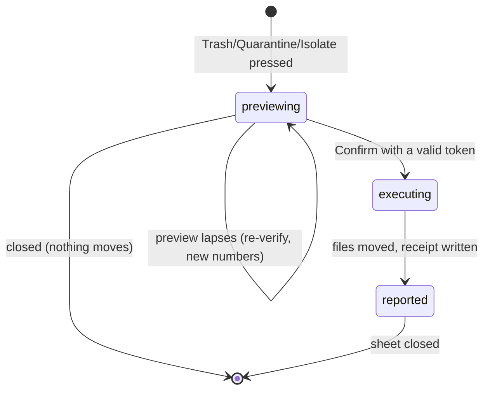

# The action sheet

## Summary

The action sheet is the last gate between selections and consequences: the user asks to Trash, Quarantine, or Isolate, the sheet previews exactly what will move and where, counts down while that preview stays trustworthy, and only then executes — revalidating every file one final time as it moves. It is opened from the action bar under the [group list](group-list.md) (`a` previews Trash), and it is the only place destructive actions begin in the UI. The safety layers it orchestrates are owned by [Actions and undo](../foundations/actions-and-undo.md); what Trash, Quarantine, and Isolate each mean lives there too.

## The simple case

The user has selections across some groups and presses **Trash** (or `a`). A dry run computes the effective selection — vetoes applied, keepers protected — and the sheet lists what will happen: how many files from each category (exact duplicates, similar, non-human, low-res, random, faces), the total bytes, the destination. A line under the numbers reads "Verified against the current selection · preview valid for 10:00" and counts down. The user presses Confirm; the files move, the sheet reports the outcome, moved files disappear from their groups, and a receipt is written.

## The interaction, event by event

### Start

The request for a preview is a dry run of the chosen action against the current selection. The server computes the effective selection, runs the full batch preflight — every file checked against the disk, exact groups re-hashed, keepers validated — and returns the itemized outcome plus a **preview token**: a one-use authorization bound to this exact preview (this scan, this action, this scope, this destination, this set of eligible files). The token lives **10 minutes** (600 seconds). The sheet shows the numbers and the countdown.

Files that failed preflight appear in the preview as failures with reasons, not silently dropped — the user sees that a changed file will not move.

For **Quarantine**, the destination directory comes from the quarantine field (remembered across visits); executing without one is refused. For **Isolate**, the sheet takes the mode (copy by default; hardlink, symlink, move) and the scope (all groups, duplicates only, or review suggestions only); the review directory defaults to `_Dedupe Review` inside the scanned source.

### End without changing anything

Closing the sheet — Escape or Cancel — discards the preview and its token. Nothing moves, nothing is recorded. The selections in the group list are untouched.

### Become extended

The preview is the extended state; it exists to be confirmed. It becomes consequential the moment Confirm is pressed with a valid token: the action lock is taken, and file movement begins.

### While extended

The countdown ticks each second. If the user changes the selection elsewhere while the sheet is open, the token no longer matches — on Confirm the server reports "selection changed since the preview; preview again and confirm the new numbers," and the sheet re-runs the preview automatically so the user confirms the refreshed figures. If the 10 minutes elapse, the same re-preview happens with "preview expired after 10 minutes…". A missing token (a page reload mid-sheet) re-previews too. The execute is never attempted with a stale token — that invariant is the whole reason the token exists.

### Complete

Executing consumes the token and runs the action with per-file immediate revalidation. The sheet reports the result: each file's outcome and destination, failures with reasons, and where receipts were written. Then:

- Moved files are dropped from their groups in the displayed results; groups below their minimum size dissolve. A keeper that somehow moved (it cannot in a duplicate group, but a similar group's keeper is a recomputation) is re-picked from the survivors.
- The updated result is persisted to the review session.
- For **Trash** there is a wrinkle the sheet spells out: selections from the *low-resolution and random review* categories do not go to the system Trash — they are quarantined into a `_Dedupe Quarantine` folder beside the scanned source, and the sheet reports how many and where. Everything else in a Trash action goes to the macOS Trash. The two parts write separate receipts.
- For **Isolate**, the result includes the review folder, which the user can reveal in Finder from the sheet.

## Modifiers

| Modifier | Set at the start | Changed while extended |
| --- | --- | --- |
| Action choice (Trash / Quarantine / Isolate) | Selects the destination semantics ([Actions and undo](../foundations/actions-and-undo.md#the-three-actions)). | The sheet is per-action; switching means a new preview. |
| Scope (isolate kinds: all / duplicates / review suggestions) | Limits which groups the action touches; protection rules still consider every group. | Fixed per preview. |
| Quarantine / review directory | Chosen before executing; remembered between sessions for quarantine. | Changing it after previewing produces a "changed" verdict on Confirm — re-preview with the new destination. |
| Selection state | Defines the preview's numbers. | Any change invalidates the token; re-preview on Confirm. |

## Cancel and interrupt

| Event | Before Confirm | During execution |
| --- | --- | --- |
| The user aborts explicitly | Escape/Cancel closes the sheet; the token dies unused. | There is no cancel mid-action; the file list runs to completion. |
| The user does something else mid-way | Selection changes elsewhere invalidate this preview (handled at Confirm by re-preview). | Other selection and action requests are refused with "file actions are locked during active work" until the action finishes. |
| A clean complete happens elsewhere | Only one action can hold the lock; a second sheet's execute waits or is refused. | Same lock: nothing runs alongside. |
| The environment fails | Preflight failures are inside the preview — a disk problem shows as per-file errors before any Confirm. | Per-file failures are recorded and the rest proceed; the sheet shows both. |
| The page or process goes away | A reload discards the sheet and its token; selections survive server-side. | The action is server-side: a reload re-attaches to the finished (or still running) state via status. Server death mid-action is the unsafe window: some files moved, and the receipt may not exist ([Actions and undo](../foundations/actions-and-undo.md#cancel-and-interrupt)). |
| Something else changes the target | Caught by the preflight inside the preview, and again by per-file immediate revalidation at move time. | Same; a file that changes in the last instant is the unclosed race, stated in the foundation document. |
| The input channel changes | No effect. | No effect. |
| A resumed review supersedes | Resume is locked while acting; otherwise it replaces the result and voids every preview token (new scan id). | Locked out until the action completes. |

## Interactions with other systems

**Files on disk.** Executed trash/quarantine actions write receipts to `~/.cache/dedupe/logs/` (the Trash-split case writes two). Quarantine creates/uses the chosen folder; the review-suggestion split creates `_Dedupe Quarantine` beside the scan root; isolate creates its session tree under `_Dedupe Review`.

**Safety and undo.** This sheet is the UI face of the five-layer model in [Actions and undo](../foundations/actions-and-undo.md#the-safety-model): effective selection, batch preflight, keeper protection, immediate revalidation, receipt.

**Review sessions.** After an executed trash/quarantine, the shrunken result is saved immediately, so a restart never resurrects moved files into the review.

**Optional dependencies.** None: actions move bytes; previews do not decode media.

**Concurrency and resource limits.** Executed actions use a bounded worker pool, results in input order; the acting lock serializes against scans and other actions.

**macOS specifics.** Trash goes through the system trash per volume; the `_Dedupe Quarantine` split exists precisely so review-category removals stay recoverable without relying on Finder habits.

**Configuration and defaults.** Preview token lifetime: 600 s, fixed. Quarantine directory: user-supplied, remembered. Isolate mode: copy, fixed default.

## Edge cases

- Confirming a preview of zero eligible files is allowed and reports nothing moved — useful as a sanity check, harmless.
- The two-part Trash action (system trash + review quarantine) can partially fail: one part's receipt exists, the other's files stayed. The sheet reports per-file outcomes.
- A preview taken during a scan cannot happen — actions refuse while scanning — so the token's scan id is always the live one.
- Isolate dry runs validate every member up front; one stale file cancels the whole isolate unless the request was a preview.

## Open questions and verification

- The automatic re-preview on a stale token is read from the client's stale-response handling; the visible sequence (sheet numbers refresh without closing) should be confirmed by hand.
- The countdown's behavior when the tab is backgrounded (timer throttling) is unexamined; the server-side expiry is authoritative regardless.
- Whether the review-quarantine split is explained to the user before their first Trash of review candidates, or only in the result, is a copy question worth raising.

Verified against dedupe commit `2a6cede`.
