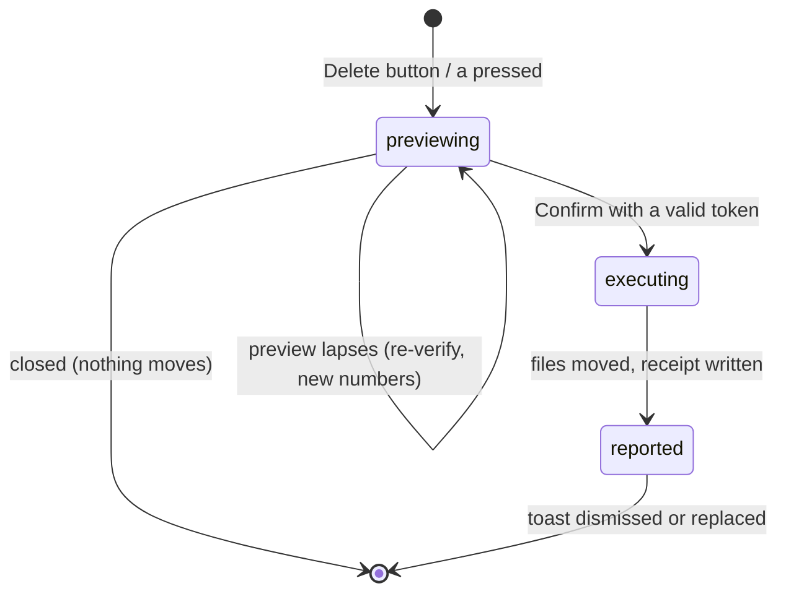

# The action sheet

## Summary

The action sheet is the last gate between selections and consequences: the user asks to delete the selected exact matches, the selected similar matches, or the staged low-res/random review deletions; the sheet previews exactly what will move and where, counts down while that preview stays trustworthy, and only then executes — revalidating every file one final time as it moves. It is opened from the action bar under the [group list](group-list.md) (the three **Delete All Selected…** buttons, `a` for the exact-match sheet, or `A` — Shift+`a` — for the similar-match one), and it is the only place destructive actions begin in the UI. The UI's action is always Trash; Quarantine and Isolate exist only on the command line ([`scan`](../cli/scan.md), [`isolate`](../cli/isolate.md)). The safety layers the sheet orchestrates are owned by [Actions and undo](../foundations/actions-and-undo.md).

## The simple case

The user has selections in some groups and presses **Delete All Selected Exact Matches** (or `a`). A dry run computes the effective selection — vetoes applied, keepers protected — and the sheet lists what will happen: how many files, the total bytes, and any files that failed verification. The **Delete All Selected Low-res + Random** button covers the staged [low-resolution](low-res-review.md) and [random-review](random-review.md) deletions instead, and its sheet leads with the different destination: those files move to a `_Dedupe Quarantine` folder beside the scan, not the system Trash, and the Confirm button reads **Move to Quarantine**. A line under the numbers reads "Verified against the current selection · preview valid for 10:00" and counts down. The user confirms with the Confirm button; the files move, the result is reported on a toast, moved files disappear from their groups, and a receipt is written.

## The interaction, event by event

### Start

Each of the three action-bar buttons is scoped: one covers exact-match selections, one similar-match selections, and one the staged low-resolution and random-review selections; each is disabled with an explanatory tooltip while its scope has no selections. All three have keyboard shortcuts: `a` previews the exact matches, `A` (Shift+`a`) the similar matches, `D` (Shift+`d`) the Low-res + Random review selections, and the `?` help sheet lists them together — "a / A / D — Preview Trash for selected exact / similar / Low-res + Random review files". Pressing one starts a dry run of the Trash action against the current selection. The server computes the effective selection, runs the full batch preflight — every file checked against the disk, exact groups re-hashed, keepers validated — and returns the itemized outcome plus a **preview token**: a one-use authorization bound to this exact preview (this scan, this action, this scope, this destination, this set of eligible files). The token lives **10 minutes** (600 seconds). The sheet shows the numbers and the countdown.

While the dry run and any execute are in flight, the action bar is disabled and a status note ("Verifying the selection against the files on disk…", then "Moving files to Trash…") says what is happening; there is no silent wait.

Files that failed preflight appear in the preview as failures with reasons, not silently dropped — the user sees that a changed file will not move.

The sheet opens with keyboard focus on **Cancel**, so a stray Enter can never confirm: Enter confirms only when the Confirm button itself has focus, and Tab cycles within the sheet instead of leaving it.

### End without changing anything

Closing the sheet — Escape, Cancel, or Enter while Cancel has focus — discards the preview and its token. Nothing moves, nothing is recorded. The selections in the group list are untouched.

### Become extended

The preview is the extended state; it exists to be confirmed. It becomes consequential the moment Confirm is pressed with a valid token: the action lock is taken, and file movement begins.

### While extended

The countdown ticks each second, computed against an absolute expiry time rather than counted down, so a backgrounded tab cannot drift: when the browser throttles the timer and the user returns, the next tick shows the true remaining time, and if the token lapsed while away the sheet closes and re-verifies immediately. If the user changes the selection elsewhere while the sheet is open, the token no longer matches — on Confirm the server reports "selection changed since the preview; preview again and confirm the new numbers," and the sheet re-runs the preview automatically so the user confirms the refreshed figures. If the 10 minutes elapse, the same re-preview happens with "preview expired after 10 minutes…". A missing token (a page reload mid-sheet) re-previews too. The execute is never attempted with a stale token — that invariant is the whole reason the token exists; even a Confirm click that races the expiry tick is refused by the server and answered with a fresh preview. After two automatic re-verifications the sheet stops asking and waits for the user to start over.

### Complete

Executing consumes the token and runs the action with per-file immediate revalidation. A toast reports the result — how many moved, how many were skipped or failed with the first reason, and whether a receipt was written. When review-category files were part of the action, the toast notes how many landed in `_Dedupe Quarantine`. The sheet's failure paths — the dry run refusing ("Could not verify selection…"), the preview refusing to settle, an execute error — raise sticky error toasts: they stay until dismissed with their ✕ button, and further toasts queue behind them rather than replacing them (the toast rules are owned by the [group list](group-list.md)). Then:

- Moved files are dropped from their groups in the displayed results; groups below their minimum size dissolve. A keeper that somehow moved (it cannot in a duplicate group, but a similar group's keeper is a recomputation) is re-picked from the survivors.
- The updated result is persisted to the review session.
- The Trash split: selections from the *low-resolution and random review* categories do not go to the system Trash — they are quarantined into a `_Dedupe Quarantine` folder beside the scanned source, and the Low-res + Random sheet's Confirm button says **Move to Quarantine** to make that plain. Exact and similar selections go to the macOS Trash. (The server still supports a single Trash request spanning both destinations and writes two receipts for it, but the UI's scoped buttons never mix scopes in one sheet.)

## Modifiers

| Modifier | Set at the start | Changed while extended |
| --- | --- | --- |
| Button choice (Exact / Similar / Low-res + Random) | Selects which selections the Trash action covers; the review scope's sheet leads with the `_Dedupe Quarantine` destination. `a` / `A` open the exact / similar sheets from the keyboard; the review scope is button-only. | Fixed per sheet; another scope needs its own preview. |
| Selection state | Defines the preview's numbers. | Any change invalidates the token; re-preview on Confirm. |

## Cancel and interrupt

| Event | Before Confirm | During execution |
| --- | --- | --- |
| The user aborts explicitly | Escape/Cancel closes the sheet; the token dies unused. | There is no cancel mid-action; the file list runs to completion. |
| The user does something else mid-way | Selection changes elsewhere invalidate this preview (handled at Confirm by re-preview). | Other selection and action requests are refused with "file actions are locked during active work" until the action finishes. |
| A clean complete happens elsewhere | Only one action can hold the lock; a second sheet's execute waits or is refused. | Same lock: nothing runs alongside. |
| The environment fails | Preflight failures are inside the preview — a disk problem shows as per-file errors before any Confirm. | Per-file failures are recorded and the rest proceed; the toast reports both. |
| The page or process goes away | A reload discards the sheet and its token; selections survive server-side. | The action is server-side: a reload re-attaches to the finished (or still running) state via status. Server death mid-action is the unsafe window: some files moved, and the receipt may not exist ([Actions and undo](../foundations/actions-and-undo.md#cancel-and-interrupt)). |
| Something else changes the target | Caught by the preflight inside the preview, and again by per-file immediate revalidation at move time. | Same; a file that changes in the last instant is the unclosed race, stated in the foundation document. |
| The input channel changes | No effect. | No effect. |
| A resumed review supersedes | Resume is locked while acting; otherwise it replaces the result and voids every preview token (new scan id). | Locked out until the action completes. |

## Interactions with other systems

**Files on disk.** Executed Trash actions write receipts to `~/.cache/dedupe/logs/` (the split case writes two). The review-suggestion split creates `_Dedupe Quarantine` beside the scan root.

**Safety and undo.** This sheet is the UI face of the five-layer model in [Actions and undo](../foundations/actions-and-undo.md#the-safety-model): effective selection, batch preflight, keeper protection, immediate revalidation, receipt.

**Review sessions.** After an executed Trash, the shrunken result is saved immediately, so a restart never resurrects moved files into the review.

**Optional dependencies.** None: actions move bytes; previews do not decode media.

**Concurrency and resource limits.** Executed actions use a bounded worker pool, results in input order; the acting lock serializes against scans and other actions.

**macOS specifics.** Trash goes through the system trash per volume; the `_Dedupe Quarantine` split exists precisely so review-category removals stay recoverable without relying on Finder habits.

**Configuration and defaults.** Preview token lifetime: 600 s, fixed. Automatic re-previews per sheet: at most 2.

## Edge cases

- Confirming a preview of zero eligible files is allowed and reports nothing moved — useful as a sanity check, harmless. (Every button is disabled while its scope has no selections at all.)
- The two-part Trash action (system trash + review quarantine) can partially fail: one part's receipt exists, the other's files stayed. The result reports per-file outcomes.
- A preview taken during a scan cannot happen — actions refuse while scanning — so the token's scan id is always the live one.

## Open questions and verification

- The automatic re-preview on a stale token is read from the client's stale-response handling; the visible sequence (sheet numbers refresh without closing) should be confirmed by hand.
- The review-quarantine split leads the Low-res + Random preview (restored after the "simplify duplicate deletion actions" change dropped the scope from the action bar entirely — see [bug-triage](../bug-triage.md) B-06); confirm the wording by hand on a scan with low-res candidates.

Verified against the post-improvement working tree (2026-09 UX phase; pinned at `2a6cede` plus later improvement commits).
