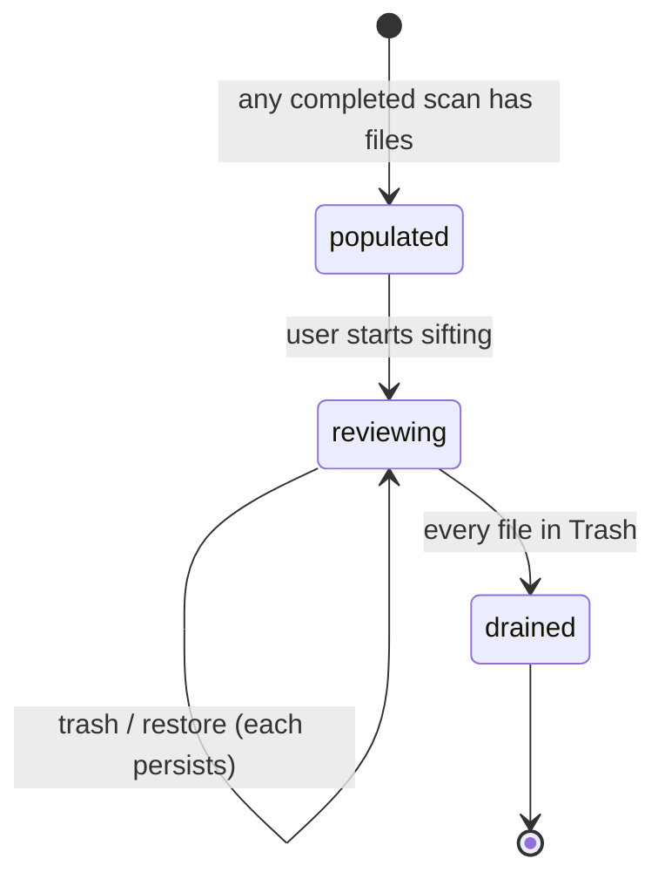

# The all-files review

## Summary

The all-files review — the **Files** tab — lists every scanned media file in the scanned folders, whether or not any detector flagged it, so the user can sift a whole folder for deletion candidates that belong to no review category. It needs no scan option and no detector: one group per scanned folder is built from the scan's file inventory when results load, ordered by path so sifting follows the folder structure. Members are independent [review candidates](../glossary.md) and share the one-click Trash and undo mechanics of the [no-person](no-person-review.md) and [faces](faces-review.md) reviews; the shared list mechanics are owned by [Group list](group-list.md), and the safety model by [Actions and undo](../foundations/actions-and-undo.md).

## The simple case

The user scans a folder — any scan, with any options. When the scan finishes, the Files tab's count equals the number of files scanned, and its sidebar holds one row per scanned folder, named with the folder's name. Opening a row shows that folder's entire media inventory as paged triage cards, path-ordered, nothing selected. The user pages through (50 cards per page) or opens the [lightbox](lightbox.md) on the first card and holds the arrow keys: `←`/`→` step through the folder without stopping at page boundaries, `d` (or `Delete`/`Backspace`, or the on-screen Trash button) moves the current file to the macOS Trash in one click and advances to the next, `r` reveals the current file in Finder, and the sticky toast's Undo brings a just-trashed file straight back.

## The interaction, event by event

### Start

The category exists for every scan: it is built from the scan's file inventory, not from any detector, so it appears even when every detection option is off, and it costs the scan nothing. Each scanned folder gets its own group — a multi-folder scan, with or without parallel streams, lists one row per folder, so the tab doubles as the folder picker. A file under overlapping scanned roots (scanning both `a` and `a/b`) joins the deeper folder's group.

Membership is every media file the scan inventoried: images, GIFs, and videos, subject to the scan's media-type and hidden-file options. Files that are not media are never inventoried, so they never appear — the view sifts media, not documents or archives. Ordering is by path, so siblings in the folder tree sit together. Nothing is selected, nothing is reviewed, and there is no suggested keeper; the list pages at 50 cards per page, like the other independent categories.

Unlike the detector categories, Files groups do not stream into the sidebar mid-scan; the tab fills in when the scan completes. A review session saved before this view existed gains its Files groups when the session loads, built from the saved inventory — review progress from the old session is untouched.

Cards carry no detector verdict: the evidence line reads "Every scanned media file in this folder appears here, category or not."

### End without changing anything

Browsing without trashing records nothing. The list is rebuilt from the inventory exactly as it was; leaving and returning shows the same files.

### Become extended

The review becomes consequential at the first per-candidate trash: the file is preflighted and moved to the Trash in the same request, the trash is recorded in the [review session](../foundations/review-session.md) immediately, and the candidate is marked reviewed.

### While extended

**Per-candidate Trash and undo.** Identical to the [no-person review](no-person-review.md#while-extended): each card and the lightbox offer one-click Trash (`d` / `Delete` / `Backspace` on the focused card or inside the lightbox); the server preflights the file, refuses it with its reason when it is not safely eligible — changed since the scan, missing, a symbolic link, outside the scanned roots — and otherwise moves it to the macOS Trash with no confirmation sheet. The trashed card stays in place as a "Moved to Trash" placeholder so the grid never reflows, **N in Trash · Show** reveals deleted cards with their restore control, and the toast's Undo restores the file to its original path. In the lightbox a trash advances to the next remaining file; undo reinserts it. The restore survives restarts and resumes (the trash map rides in the session save) and only an entirely new scan ends it — announced at scan start by the one-time toast described in [Session resume](session-resume.md) — after which Finder's Trash remains the recovery path.

**No selection semantics.** The category has no checkboxes, no smart-select rules, and no bulk operations: bulk selection and the selection rules leave Files groups untouched, and no [action sheet](action-sheet.md) scope covers them. Files leave the view through one-click trash, or through their membership in another category — an executed exact/similar Trash or low-res/random Quarantine removes the moved files from the Files group too.

**Sorting.** The card pager's sort control offers four orders: Folder order (path) — the default, following the folder tree — Largest first, Newest first, and Oldest first. Largest first surfaces the space hogs immediately, which is usually the point of a deletion sift. The lightbox steps in the same order as the grid.

**Revealing.** Each card and the lightbox (`r`) offer **Reveal in Finder**, so an ambiguous thumbnail can be inspected in place mid-sift.

**Progress.** The detail header counts reviewed files and trashed files: trashed candidates count as reviewed, and a file the user decided about in another category — a low-res `←`/`→` decision — arrives pre-marked reviewed here, since the decision was already made. A reviewed-and-unselected file (a Keep anywhere, or a trashed-then-restored file) vetoes its deletion everywhere, including a one-click trash here: the refusal names the vetoing review — "Kept in the Low-res review — revise that decision before trashing it here" — so the user knows where to go.

### Complete

There is no completion goal; the category exists to be sifted, not exhausted. When every file in a folder's group is in the Trash, the pane shows "Nothing left in this review pile" and the **N in Trash · Show** control offers the way back.

## Modifiers

| Modifier | Set at the start | Changed while extended |
| --- | --- | --- |
| Multiple scanned folders | One Files group per folder; the sidebar row names the folder. | Fixed for these results; the next scan re-partitions. |
| Member sort (path / largest / newest / oldest) | Folder order (path) is the default; the choice is per category and lasts the session. | Reorders the grid and the lightbox's step order together; the page resets to the first. |
| Media-type and hidden-file scan options | Define what "every file" means — only inventoried media appears. | Fixed for these results. |
| Keyboard vs mouse | Equivalent paths to the same trash; `←`/`→` move card focus (or step inside the lightbox); `d` / `Delete` / `Backspace` trash the current file. | Fully interchangeable mid-review. |
| Saved review session | Sessions predate the view gain their Files groups on load; trashed-file state and undo controls restore with the session. | Every trash and undo saves it again. |
| Scan or action running | The tab fills in only when the scan completes. | Trashing is refused with "locked during active work" until the work ends. |

## Cancel and interrupt

| Event | Before decisions | While reviewing |
| --- | --- | --- |
| The user aborts explicitly | No effect. | No cancel exists for a trash: the undo controls (toast, deleted card) are the reversal. |
| The user does something else mid-way | No effect. | Switching tabs or filters keeps all state; trashed candidates stay marked in every view. |
| A clean complete happens elsewhere | No effect. | An executed action from another category removes the moved files from the Files group as well. |
| The environment fails | The category is inventory-only, so nothing here fails that the scan itself did not already absorb. | A trash that fails preflight is refused with its reason; the file stays. |
| The page or process goes away | Reload restores the category from the server's result. | Trashes persist as made; a crash loses at most the one in flight; the trash map survives restarts with the session. |
| Something else changes the target | Invisible until trash time; cards show scan-time snapshots. | Caught at preflight and again immediately before the move; changed files are refused, not trashed. |
| The input channel changes | No effect. | No effect. |
| A resumed review supersedes | One way the category is populated; older sessions are upgraded with Files groups built from the saved inventory. | Resume is locked out while a scan or action runs; otherwise it replaces the category with the session's pruned state. |

## Interactions with other systems

**Files on disk.** Sifting writes nothing itself beyond the review session save that every trash triggers; trashed files go to the macOS Trash. See [Files Dedupe writes](../cross-cutting/caches-and-files.md).

**Safety and undo.** Per-candidate trash shares the no-person flow's preflight, refusal, and session-limited restore — see [Actions and undo](../foundations/actions-and-undo.md). The Keep veto applies here too: a file kept in any independent category refuses a one-click trash until that decision is revised.

**Review sessions.** Files groups are rebuilt from the saved inventory when an older session loads; the per-candidate trash map restores exactly as in the no-person and faces flows.

**Optional dependencies.** None for membership — no detector feeds this category. Video thumbnails and playback still depend on ffmpeg, as everywhere; see [Optional dependencies](../cross-cutting/optional-dependencies.md).

**Concurrency and resource limits.** Building the groups is a partition and sort of the inventory at scan completion — no extra I/O. The session file carries the Files groups like any other, so a saved review grows with the library size; large-session saves are debounced per [Review session](../foundations/review-session.md).

**macOS specifics.** Trash and manual recovery go through the macOS Trash; HEIC/TIFF thumbnails are transcoded on demand.

**Configuration and defaults.** Always on; there is no option, threshold, or count to set.

## Edge cases

- The tab's count is the scanned-file count, and it includes files already in the Trash — trashed candidates stay members (hidden behind **N in Trash · Show**) so their undo survives.
- A file can appear here and in exact, similar, low-res, random, Non-Human, and Faces groups at once; trashing or acting on it anywhere removes it everywhere, and a Keep anywhere vetoes its trash here.
- Non-media files — documents, archives, sidecars — are never inventoried, so the view cannot sift them; "every file" means every scanned *media* file.
- Overlapping scanned roots place each file in the deeper folder's group only; no file appears in two Files groups.
- The card grid pages at 50, but the lightbox does not: stepping past the 50th file simply continues into the next page's files.

## Open questions and verification

- The exact wording of the detail summary line was read from the renderer, not watched in a browser.
- Behavior of the Files tab while a scan streams other categories (empty until completion) is covered by the unit tests, not by hand.

Verified against the post-improvement working tree (2026-09; the Files tab landed in this tree, covered by `tests/test_grouping.py`, `tests/test_web.py`, and the browser workflow test `test_all_files_review_trashes_uncategorized_files_from_the_lightbox`).
