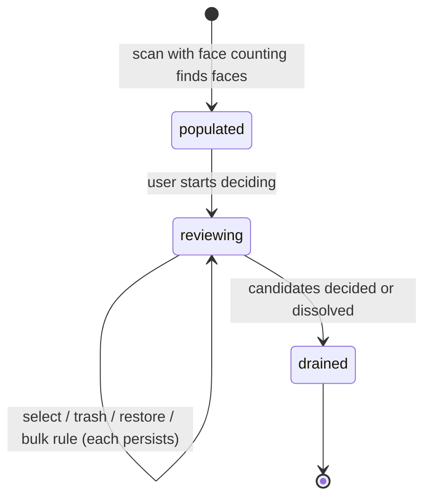

# The faces review

## Summary

The faces review — the **Faces** tab — lists every file in which the scan detected at least one face, so the user can find the people-heavy shots (group photos above all) and decide what to do with them. It is opt-in at scan time, ordered busiest-shot first, and honest about its limits: face counting is heuristic, the UI says so wherever deletion is offered, and the filters and bulk rules never touch a file the counter did not actually analyze. Candidates are independent [review candidates](../glossary.md), sharing their mechanics — paging, selection, per-candidate Trash and undo — with the [no-person review](no-person-review.md); what a group is and how selections act is owned by [Duplicate group](../foundations/duplicate-group.md) and [Actions and undo](../foundations/actions-and-undo.md).

## The simple case

In [Scan setup](scan-setup.md) the user enables face counting and scans. When the scan finishes, the Faces tab lists every file with at least one detected face, ordered by face count — the busiest shots first, newest first within a tie — with per-file totals including male counts. Nothing is selected. The user pages through, trashes individual candidates they want gone (with a miscount warning and a preview), or uses the Faces filter and bulk selection — for example, select every file with at least N faces — and confirms the result through the [Action sheet](action-sheet.md).

## The interaction, event by event

### Start

Face counting runs during the scan only when enabled: faces are detected with the bundled OpenCV YuNet model and classified by gender with the bundled InsightFace genderage model — both ship with the application, both are CPU-only, nothing downloads at runtime. Images are counted directly, GIFs through representative frames, and videos through up to 16 directly-seeked sampled frames. Each file that yields at least one face becomes a candidate carrying its total count and its male count. Files the counter never analyzed do not enter the category.

Membership is re-checked whenever results load: a file without a current face count (at least one) no longer belongs in the flow, and cached results that predate a re-analysis are filtered out the same way. Ordering is busiest-shot first — highest face count, then newest by modification time — so group photos surface at the top. Nothing is selected, nothing is reviewed, and there is no suggested keeper; the list pages at 50 cards per page, like the other independent categories.

Cards show the counts plainly: a face badge ("3 faces", or "No faces" in views where zero-count files appear), a male badge when the count is nonzero ("2 males"), and tooltips naming both detectors and the word *heuristic*.

### End without changing anything

Browsing without deciding records nothing. Selections live server-side, so leaving and returning restores the same list and state.

### Become extended

The review becomes consequential at the first persisted decision: a selection toggle, a bulk rule, or a per-candidate trash. Each is validated against the current scan id and saved to the [review session](../foundations/review-session.md) immediately.

### While extended

**Selecting.** Checkboxes, bulk operations, and the reviewed-before-acting rule all behave as described in [Group list](group-list.md#while-extended) and [Duplicate group](../foundations/duplicate-group.md#what-actually-acts-the-effective-selection): a candidate acts only when selected *and* reviewed; bulk selection marks candidates reviewed; a reviewed-and-unselected candidate becomes a durable [Keep decision](../glossary.md) that vetoes its deletion everywhere.

**The Faces filter.** The Advanced filters include a Faces dropdown with four positions, each with exact semantics:

| Position | Matches |
| --- | --- |
| Any | No face filtering. |
| 1+ faces | Files whose count is at least 1. |
| 1+ male faces | Files with at least one male-classified face; scans that predate the genderage pass report no male count and never match. |
| No faces (0) | Files whose count is exactly 0 — meaning the counter *ran and found zero*. Files without a trusted count never match this (or any) face filter. |

The rule behind all four: a bulk-deletable view must never be built from files the counter did not actually analyze.

**Bulk selection by face count.** The bulk criteria include a minimum face count: select every shown candidate with at least N faces (minimum 1). A file with no recorded count never matches, for the same reason as the filter.

**Per-candidate Trash and undo.** Each card's Trash control runs the same one-click flow as the [no-person review](no-person-review.md#while-extended): the server preflights the file, refuses it when it is not safely eligible, and otherwise moves it to the macOS Trash in the same request. There is no confirmation sheet. A toast offers Undo and stays until another message replaces it; showing deleted cards restores the per-candidate control. Face counts remain heuristic. The restore persists in the review session exactly like the no-person flow's: it survives restarts and resumes, and only an entirely new scan clears it — announced at scan start by the one-time toast described in [Session resume](session-resume.md) — after which the file is still recoverable from the Trash by hand.

### Complete

The category is consumed like any other: reviewed-and-selected candidates flow into the [Action sheet](action-sheet.md), or the list drains candidate by candidate until the group dissolves.

## Modifiers

| Modifier | Set at the start | Changed while extended |
| --- | --- | --- |
| Face counting enabled at scan time | Defines whether this category exists at all; counts come from that run. | Fixed for these results; the next scan counts again. |
| List filters (including the Faces dropdown) | Narrow what is shown without changing what exists. | Live; hidden candidates keep their selections, and bulk operations apply to shown candidates only. |
| Keyboard vs mouse | Equivalent paths to the same decisions; `←`/`→` move card focus in this paged category; `d` / `Delete` / `Backspace` trash the focused card. | Fully interchangeable mid-review. |
| Saved review session | Restores candidates, selections, and reviewed paths, pruned per [Review session](../foundations/review-session.md). | Every decision saves it again. |
| Scan or action running | Candidates sit locked; decision requests are refused with "locked during active work". | The lock releases when the scan or action ends. |

## Cancel and interrupt

| Event | Before decisions | While reviewing |
| --- | --- | --- |
| The user aborts explicitly | No effect. | No cancel exists for a decision: deselecting undoes a selection; a just-trashed candidate is restored from the toast or its card. |
| The user does something else mid-way | No effect. | Switching tabs or filters keeps all state; selections follow their candidates, not the view. |
| A clean complete happens elsewhere | No effect. | An executed action removes acted-on candidates and may dissolve the group; bulk rules rewrite what they touch; both persist immediately. |
| The environment fails | If face counting cannot run (OpenCV unavailable), the category has no candidates rather than wrong ones; files with failed counts stay out. | A per-candidate trash that fails preflight is refused with its reason; bulk criteria never select unanalyzed files, so a counting gap cannot become a deletion. |
| The page or process goes away | Reload restores the category from the server's result. | Decisions persist as made; a crash loses at most the one in flight. The trash map rides in the review session save, so restarts keep the undo controls; a new scan clears them. |
| Something else changes the target | Invisible until action time; counts and cards show scan-time snapshots. | Caught by the safety model at preview and again immediately before each move; changed files are refused, not trashed. |
| The input channel changes | No effect. | No effect. |
| A resumed review supersedes | One way the category is populated; members without a current face count are filtered out during load. | Resume is locked out while a scan or action runs; otherwise it replaces the category with the session's pruned state. |

## Interactions with other systems

**Files on disk.** Reviewing writes nothing itself beyond the review session save that every decision triggers; acted-on files go where the chosen action sends them. See [Files Dedupe writes](../cross-cutting/caches-and-files.md). Face counts are cached with the detector signature that produced it, so rescans reuse them until the file or the models change.

**Safety and undo.** Per-candidate trash shares the no-person flow's preflight and preview-token mechanism, and the same session-limited restore; bulk deletion is guarded by the unanalyzed-file refusal described above. Everything else is the standard model in [Actions and undo](../foundations/actions-and-undo.md).

**Review sessions.** Candidates without a current face count are dropped when a session loads, and selections and reviewed paths are pruned with them; everything else restores as saved.

**Optional dependencies.** Face counting needs OpenCV (YuNet + genderage models bundled); video frame sampling uses ffmpeg. Degraded behavior per dependency is collected in [Optional dependencies](../cross-cutting/optional-dependencies.md).

**Concurrency and resource limits.** Counting runs on the scan's worker budget (OpenCV detection capped at 4 concurrent detector instances); videos sample a duration-scaled 4–16 frames each (about one frame per five seconds), so long videos cost no more than 16 frames and short clips no fewer than 4. Reviewing is light; thumbnails are cached server-side.

**macOS specifics.** Trash and manual recovery go through the macOS Trash; HEIC/TIFF thumbnails are transcoded on demand.

**Configuration and defaults.** Face counting is off until enabled at scan time; video sampling scales with duration between 4 and 16 frames; the minimum-face bulk criterion accepts values of 1 or more. The Faces filter positions are fixed.

## Edge cases

- A file whose faces appear only in unsampled video frames can be counted low or missed entirely — the 16-frame sampling is the ceiling of the method, and the miscount warning exists for exactly this.
- Miscounts go both ways: overlapping or obscured faces can count low; face-like patterns can count high. The warning is shown before every candidate deletion.
- A face candidate that also belongs to a duplicate group obeys both policies: a Keep decision here vetoes deletion there.
- Gender classification is a separate model pass; a scan predating it reports totals but no male counts, and the 1+ male faces filter treats those files as non-matching rather than guessing.
- Files with zero detected faces never enter this category; the No faces filter position is where zero-count media is examined from other tabs.
- When the last candidate is removed or acted on, the group dissolves from the list.

## Open questions and verification

- The exact card layout of the count badges was read from the client's rendering code, not watched in a browser.
- Whether face-count decisions hydrate from the hash cache across scans is suggested by the detector signature on each record; confirm in [Files Dedupe writes](../cross-cutting/caches-and-files.md)'s terms.
- The scan-time behavior when face counting is enabled but OpenCV is unavailable (error vs empty category) was not confirmed.
- The per-candidate undo's new-scan behavior (trash map cleared with the superseded session, announced by the one-time toast in [Session resume](session-resume.md)) is the same as the [no-person review](no-person-review.md#open-questions-and-verification); one triage entry covered both.

Verified against the post-improvement working tree (2026-09 UX phase; pinned at `2a6cede` plus later improvement commits).
