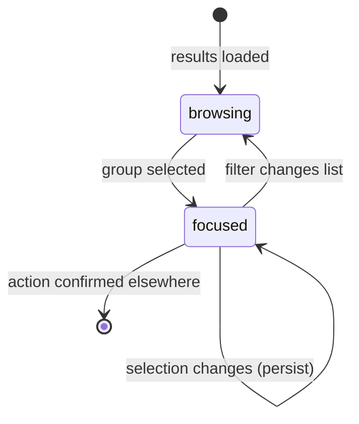

# The group list

## Summary

The group list is where the review happens: a sidebar of every group the scan found, a detail pane showing the members of the one group in focus, and the controls to filter, navigate, and select without touching the mouse. It is the screen most of the user's time goes to, sitting between [Scan setup](scan-setup.md) (which fills it) and the [Action sheet](action-sheet.md) (which consumes its selections). What a group *is* — its keeper, its policy, its selection rules — is owned by [Duplicate group](../foundations/duplicate-group.md).

## The simple case

After a scan, the sidebar lists every group, most reclaimable space first, with tabs to narrow to one category: All, Duplicates (exact), Similar images, Similar videos, Low-res, Random 50, Non-Human, Faces. The first group is focused; `j` and `k` walk down and up the shown list. The detail pane shows the focused group's members as cards — thumbnails, sizes, dimensions, paths — with the suggested keeper highlighted in green and, in a duplicate group, every other member already checked for removal. The user unchecks anything worth keeping, moves on, and repeats. When a group's selection is settled it shows ✔ Reviewed; unsettled groups show ● Needs review, and `[` / `]` jump between them.

## The interaction, event by event

### Start

The list loads whatever the current result holds — a fresh scan streams groups in as they are found, a completed scan shows them all, a resumed session shows its pruned survivors. The sidebar tab defaults to All. Each group card shows its kind, member count, reclaimable size, and state glyph (● / ✔). The first group becomes the focused group; focusing a group loads its members into the detail pane (paginated, 50 member cards per page with a page control and a count summary).

The list controls above it: a text search over member paths; a selection filter (all / has selection / no selection); **Issues only** (needs-attention groups); **Hide completed**; **Advanced filters** (size range in MB, minimum width/height in pixels, path substring or glob) — a group stays visible when *any* of its members matches; and a sort (reclaimable, size, date, media type). Filtering is local and instant; it narrows what is shown, never what exists.

### End without changing anything

Browsing without changing selections records nothing beyond what was already saved. Leaving the page and returning restores the same list; the focused group is not remembered across reloads.

### Become extended

Reviewing becomes consequential the first time a selection changes: the change is sent to the server, validated against the current scan id, applied, and the whole result is persisted to the review session file. From then on, a crash loses at most the last change.

### While extended

**Navigating.** `j`/`↓` and `k`/`↑` move the focus through the *shown* list (filters respected); `[` and `]` jump between the shown groups that need attention, wrapping around, with a toast when none do. Focusing a group scrolls its card into view and loads its members.

**Selecting in duplicate groups.** Each member card carries a checkbox; toggling it posts the group's new selection to the server, which enforces the last-survivor rule: a keep-one group cannot have every member selected — the keeper is restored to the selection set automatically. The suggested keeper's card is marked in green.

**Reviewing in independent categories.** In Low-res and Random 50 the detail pane is a one-item-at-a-time decision review: `←` means Delete this candidate, `→` means Keep it, applied to the focused member and advancing. A Keep is both a review and a veto; a Delete marks the candidate reviewed and selected. In Non-Human and Faces the list is paged with independent cards; decisions apply per candidate the same way, and candidates can additionally be trashed and restored one at a time from their cards (see their documents).

**Rules.** `u` applies the suggested (automatic) selection to the focused group; `s` opens the rule chooser for it (newest, oldest, largest, smallest, shortest path, deselect all — and select candidates in independent groups). `Space` toggles the focused member card's checkbox.

**Bulk selection.** The bulk controls apply one operation — select all, select none, invert, or a rule (smaller than keeper, larger/smaller than N MB, path contains, at least N faces) — to every group currently shown. The operation is re-derived on the server from its own state: keepers are never selected and at least one member of every duplicate group survives, whatever the browser asked. In independent groups, bulk-selecting candidates also marks them reviewed.

**Marking groups done with.** A similar group's detail header offers **Mark as distinct**: the group's files are recorded as pairwise distinct in the hash cache and the group disappears from this and future scans (until a file changes). The button asks for confirmation with those words first.

**Live update.** While a scan streams, groups appear and re-sort as they arrive; selection controls stay locked until the scan finishes.

### Complete

The list itself does not "complete"; the session does, when the user opens the [Action sheet](action-sheet.md) (`a` is the shortcut to preview Trash). After an executed action, moved files vanish from their groups; groups that shrink below their minimum size (two members for duplicates, one for independent categories) dissolve from the list entirely.

## Modifiers

| Modifier | Set at the start | Changed while extended |
| --- | --- | --- |
| Sidebar tab (category) | Chooses which groups load into the list. | Switching re-filters instantly; the focused group changes to the first shown. |
| Filters and sort | Narrow and order the shown list; bulk operations apply to *shown* groups only. | Live; narrowing after making selections does not undo them — hidden groups keep their selections. |
| Keyboard vs mouse | Equivalent paths to the same state changes. | Fully interchangeable mid-review. |
| Saved review session | Loads selections and reviewed paths into the list on start. | Every selection change saves it again. |
| Scan running | List streams; selection locked. | Lock released the moment the scan completes. |

## Cancel and interrupt

| Event | Before selections change | While reviewing |
| --- | --- | --- |
| The user aborts explicitly | No effect. | There is no cancel for a selection; deselecting is the undo, and every change is persisted as it is made. |
| The user does something else mid-way | No effect. | Switching tabs, filters, or groups keeps all selections; they follow their groups, not the view. Opening the lightbox or the action sheet leaves the list state untouched. |
| A clean complete happens elsewhere | No effect. | An executed action removes the moved files and may dissolve groups; a smart-select rule applied in bulk re-selects whatever it touched. |
| The environment fails | A stale scan id (from a superseded scan or resume) makes selection requests fail with "stale scan session; refresh results" — the page reloads its groups. | Same; the change that failed was not applied, and the UI's refreshed state comes from the server. |
| The page or process goes away | Reload restores the list from the server's result. | Selections are saved server-side on every change, so a reload loses nothing committed; a browser crash between a checkbox toggle and its request losing that one change is the worst case. Server death loses the in-memory result; the review session file holds the last save. |
| Something else changes the target | Invisible here; the list shows scan-time snapshots. | Caught at action time, not here ([Actions and undo](../foundations/actions-and-undo.md#the-safety-model)). |
| The input channel changes | No effect. | No effect. |
| A resumed review supersedes | That is one way the list is populated. | Resume is locked out while an action runs; otherwise it replaces the whole list and its selections with the session's pruned state. |

## Interactions with other systems

**Files on disk.** Every persisted selection rewrites the review session file; *Mark as distinct* writes to the hash cache; Keep decisions from low-resolution reviews write the keep-decisions file.

**Safety and undo.** The server-side invariants (keeper protection, last survivor, reviewed-before-acting) are enforced on every selection request regardless of the client that sent it.

**Review sessions.** The list's selections and reviewed paths are exactly what the session stores; [Session resume](session-resume.md) describes how they come back.

**Optional dependencies.** Faces filters and face counts exist only when faces counting ran (OpenCV); Non-Human exists only when person detection ran.

**Concurrency and resource limits.** Member cards paginate at 50 per page; very large independent groups never render thousands of cards at once.

**macOS specifics.** Thumbnails for HEIC/TIFF are transcoded server-side on demand; natively-rendered formats serve untouched.

**Configuration and defaults.** The keyboard map is fixed (see the table in [Scan setup](scan-setup.md)'s README quick reference); none of it is configurable.

## Edge cases

- **Needs attention** means: any member carries a scan error, or any member was deleted from this session, or the group is not complete — where *complete* means at least member-count − 1 selected (duplicate groups) or every member reviewed (independent groups).
- Invert on a group whose keeper is unselected selects everything else; on a fully selected group it deselects everything except what the server's keeper rule restores.
- A group hidden by filters keeps its selection, and bulk operations do not reach it — bulk applies to shown groups only, by design.
- Bulk criteria never select files without a trusted face count when a minimum-face rule is used; unanalyzed media is skipped rather than guessed at.
- Pressing `a` with no selection still opens the preview — it reports zero files, which is the honest answer.

## Open questions and verification

- The focused-group restoration behavior after a reload (none, per code) is worth confirming by hand — users may expect the list to remember their place.
- Toast wording for "No shown groups need attention" observed in code only.
- Whether the Similar videos tab is a separate sidebar entry or merged under Similar images depends on `kind` handling in the tab rendering; to confirm visually.

Verified against dedupe commit `2a6cede`.
