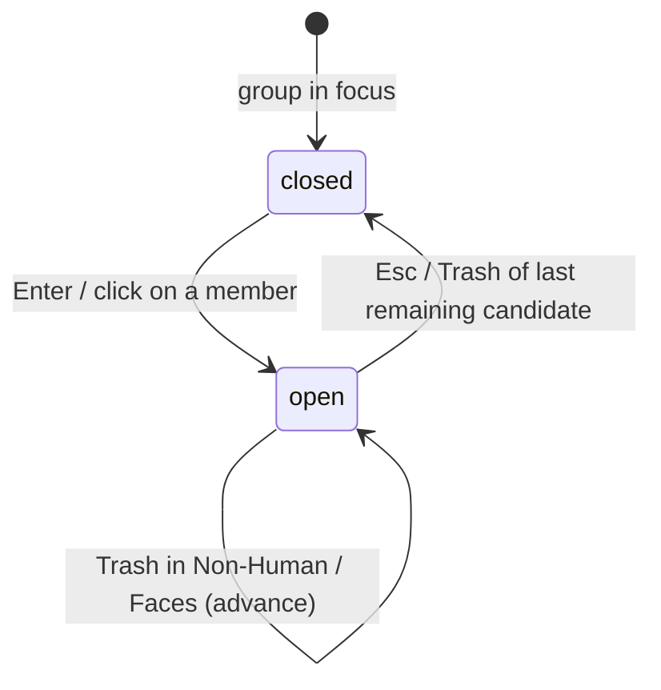

# The lightbox

## Summary

The lightbox is the full-screen overlay for looking at one member of the focused group at full fidelity — comparing candidates before deciding what stays and what goes. It opens from the [group list](group-list.md) with Enter on a member card (or the equivalent click), shows that member large, and steps through the group's members with the arrow keys or the on-screen previous/next buttons. In Non-Human and Faces review it also offers one-click Trash (`d` / `Delete` / `Backspace`, or the on-screen button), then advances to the next remaining file. Elsewhere it is a viewing tool: nothing about the selection changes while it is open. Esc returns to the group list exactly as it was.

## The simple case

The user is on a group with several members, presses Enter (or clicks a member's preview), and the lightbox opens on that member at full preview quality. `←` and `→` — or the previous/next buttons — step through the group's members one at a time; the current member shows at full fidelity while the browser can natively display it, and videos play inline with native seeking. A flicker control, where present, alternates the two views rapidly so small differences between similar images jump out. Esc closes the overlay and the user is back on the same group with the same focus and selection.

## The interaction, event by event

### Start

The lightbox opens on one member of the focused group: the member whose card has focus (Enter uses the current member focus, defaulting to the first card) or the member clicked. The image is requested at full preview fidelity from the media preview endpoints; the group context — which members exist and in what order — is the focused group's member list as shown in the detail pane.

Opening the lightbox does not pause, lock, or snapshot anything else: a scan keeps streaming behind it, and selection requests remain possible from other tabs of the same page (they are refused during scans exactly as without the lightbox).

> Technical note: browser-safe images are served as the untouched original file; formats the browser cannot render natively (HEIC, TIFF) are transcoded server-side to a cached full-resolution JPEG. Videos stream with byte ranges so seeking works natively. All previews are restricted to files from the active scan — a path that is not part of the session is refused.

### End without changing anything

Opening and immediately closing with Esc commits nothing: no selection changed, no review recorded, no request made beyond the preview fetches. The group list restores its focus to where it was.

### Become extended

The lightbox has no threshold between short and long use — it is "extended" for as long as it stays open. Navigation between members fetches each member's full preview on first visit; cached previews return instantly afterwards.

### While extended

- **Navigation.** `←` / `→` and the previous/next buttons move through the group's members. While the lightbox is open these keys navigate it and nothing else: the group-list bindings for the same keys (member focus, low-res/random Delete-Keep decisions) do not fire.
- **Videos.** A video member plays in place with the browser's native controls and seeking; while the video itself has keyboard focus, the arrow keys go to the player, not the lightbox navigation.
- **Flicker compare.** A dedicated control alternates the views being compared so subtle differences become visible; it can be held with the pointer and is also operable from the keyboard (Space / Enter on the control).
- **One-click Trash (Non-Human and Faces).** A Trash button and the `d` / `Delete` / `Backspace` keys move the current file to the system Trash immediately, then show the next remaining member. Undo is offered on the toast. Duplicate-group lightboxes do not offer this control.
- **Everything else keeps running.** The scan's progress, other browser tabs, and server state are unaffected by the overlay being open.

### Complete

The lightbox does not commit; it ends. Esc closes it, returning to the group list with focus and selection unchanged. There is no "apply" step — decisions are made back in the detail pane.

## Modifiers

| Modifier | Set at the start | Changed while extended |
| --- | --- | --- |
| Keyboard vs mouse | Enter opens on the focused member; clicking a card opens on that member. | Arrows and buttons are interchangeable throughout. |
| Media kind (image / GIF / video) | Decides what renders: still previews for images and GIFs, an inline player for videos. | No effect — navigation treats every member the same. |
| Format needing transcode (HEIC/TIFF) | Full preview is served from a cached transcode; first view of a large HEIC may take a moment. | No effect after caching. |
| Scan streaming in background | Previews resolve only for members already in the session. | Newly streamed groups are not part of the open lightbox until it is reopened. |

## Cancel and interrupt

| Event | Before opening | While open |
| --- | --- | --- |
| The user aborts explicitly | Nothing to abort. | Esc closes the lightbox at once; nothing is committed. |
| The user does something else mid-way | No effect. | Other keyboard shortcuts are suspended for the keys the lightbox owns (arrows); opening help or a modal is not offered from inside the overlay. Switching browser tabs leaves it open. |
| A clean complete happens elsewhere | No effect. | An executed action from another tab removes members; the lightbox's member list is refreshed on the next group load, and a removed member can no longer be previewed (its request would return not found). |
| The environment fails | Preview requests for unreadable or evicted files return an error; the lightbox shows that member as having no preview rather than failing the overlay. | Same per member; navigation still works. |
| The page or process goes away | No effect. | A reload closes the lightbox (overlay state is not persisted); the group list reloads from the server. Server death ends previews; the page shows its disconnected state. |
| Something else changes the target | No effect until a preview is fetched. | Previews are generated from the file on disk at request time; a changed file shows its new content, and thumbnails carry the source's modification time so stale cached bodies are not served. |
| The input channel changes | No effect. | Keyboard focus inside a video player redirects arrow keys to the player; clicking back out restores lightbox navigation. |
| A resumed review supersedes | No effect. | Resume is a page-level state change; if it occurs in another tab, this view is stale until reload. |

## Interactions with other systems

**Files on disk.** The lightbox writes nothing; preview transcodes are cached server-side (immutable, keyed by file identity) and are described in [Files Dedupe writes](../cross-cutting/caches-and-files.md).

**Safety and undo.** Viewing never moves files. In Non-Human and Faces review the overlay's Trash control is the same one-click per-candidate trash as the card, with the same restore path.

**Review sessions.** None directly; the members it shows belong to the current result, whether scanned fresh or [resumed](session-resume.md).

**Optional dependencies.** Video seeking in the lightbox depends on the browser, not on ffmpeg; thumbnails for videos come from the same cached preview pipeline the scan uses.

**Concurrency and resource limits.** Preview requests are served alongside scan work on the same server; full-resolution transcodes happen once per file and are then served from cache.

**macOS specifics.** HEIC files from iPhone libraries render through the transcode path; nothing special is required of the user.

**Configuration and defaults.** None; the lightbox has no settings.

## Edge cases

- Enter with no member focused opens on the first member of the group.
- Arrow navigation while a video has focus drives the video player, not the lightbox — click outside the player to hand the keys back.
- Esc closes the lightbox before any other overlay: it is checked first in the keyboard handling, so an open lightbox always takes the Escape.
- Members deleted by an executed action elsewhere stop resolving; their preview requests fail with not found.
- A group paginated at 50 members per page in the detail pane navigates in the lightbox over the members as loaded.

## Open questions and verification

- The exact flicker-compare behavior (which two views it alternates, whether it holds while pressed, its labeling) is read from the control's event wiring in `app.js`, not confirmed by hand.
- Whether navigation wraps around at the first/last member or stops at the ends was not confirmed from code in this pass.
- Whether the lightbox preloads neighboring members' previews or fetches strictly on demand is unconfirmed.
- The member counter/position indicator (if any) inside the overlay is unconfirmed.
- Video members without a cached preview: the preview endpoint returns "no preview" for videos with no cached still — how the lightbox presents that state (placeholder vs blank) should be checked in the running product.

Verified against dedupe commit `2a6cede`.
