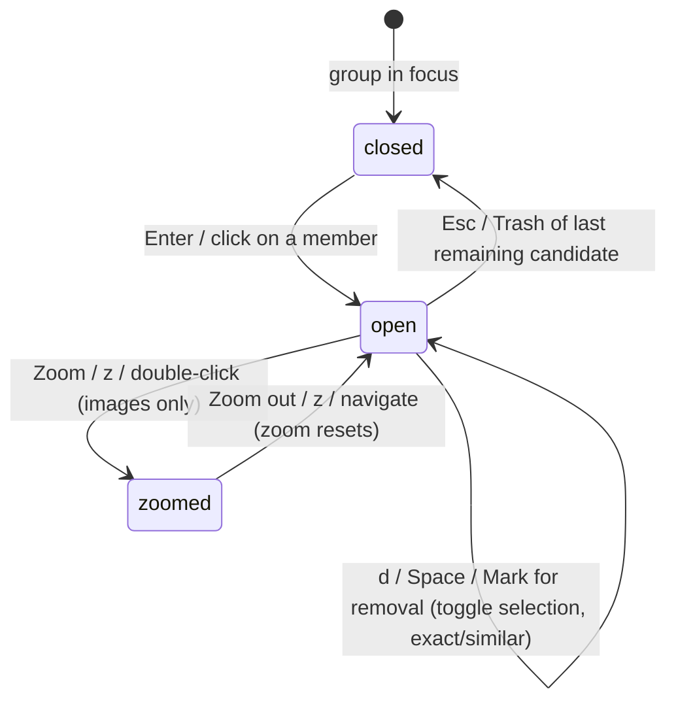

# The lightbox

## Summary

The lightbox is the full-screen overlay for looking at one member of the focused group at full fidelity — comparing candidates before deciding what stays and what goes. It opens from the [group list](group-list.md) with Enter on a member card (or the equivalent click), shows that member large with a details line (dimensions, size, modified date) under its full path, and steps through the group's members with the arrow keys or the on-screen previous/next buttons — in the paged triage categories (Non-Human, Faces, [Files](all-files-review.md)) it steps through the whole group, never stopping at a page boundary. In Non-Human, Faces, and Files review it also offers one-click Trash (`d` / `Delete` / `Backspace`, or the on-screen button), then advances to the next remaining file. In exact and similar duplicate groups the same keys — or `Space`, or the on-screen Mark for removal button — toggle the member's removal selection instead, with the group's suggested keeper always protected. Any kind can be revealed in Finder (`r`), and images can be zoomed to full resolution and panned. Esc returns to the group list with focus exactly as it was.

## The simple case

The user is on a group with several members, presses Enter (or clicks a member's preview), and the lightbox opens on that member at full preview quality. `←` and `→` — or the previous/next buttons — step through the group's members one at a time; the current member shows at full fidelity while the browser can natively display it, and videos play inline with native seeking. Under the full path, a details line lists the member's dimensions, file size, and modified date — and, in Similar groups, how similar the member is to the keeper. A flicker control, where present, alternates the two views rapidly so small differences between similar images jump out; a Mark for removal button, where present, mirrors the member card's selection checkbox; and `z` (or a double-click) zooms an image to full resolution. Esc closes the overlay and the user is back on the same group with the same focus. Stepping past the last member wraps around to the first (and vice versa), and a position indicator shows where the current member sits in the set (for example, `3 / 8`).

## The interaction, event by event

### Start

The lightbox opens on one member of the focused group: the member whose card has focus (Enter uses the current member focus, defaulting to the first card) or the member clicked. The image is requested as a large (up to 2560 px) cached preview from the media preview endpoints; the group context — which members exist and in what order — is the focused group's member list as shown in the detail pane.

Below the preview sit the full path and a details line: dimensions (`W×H`), file size, and modified date, joined by middots. In Similar groups the line adds the member's similarity to the suggested keeper (`82.5% similar to keeper`, or `similarity score unavailable` when the scan recorded none). Each part appears only when known, so the line is empty when nothing applies. When the member belongs to an exact or similar duplicate group, a Mark for removal toggle appears under the details line.

Opening the lightbox does not pause, lock, or snapshot anything else: a scan keeps streaming behind it, and selection requests remain possible from other tabs of the same page (they are refused during scans exactly as without the lightbox).

> Technical note: images are served from a cached, downscaled (≤2560 px) "preview" transcode — including browser-safe formats, which used to be served as full multi-megapixel originals; the untouched original is still available from the `full` variant of the preview endpoint. HEIC/TIFF and other formats the browser cannot render natively are transcoded server-side. After every navigation the previews of the previous member and the next few members are warmed in the background, so holding an arrow key to sift stays instant. Videos stream with byte ranges so seeking works natively. All previews are restricted to files from the active scan — a path that is not part of the session is refused. When the lightbox opens, keyboard focus moves into it (the close control) and is trapped while it is open; closing restores focus to the element that opened it. On touch screens, swiping left or right navigates.

### End without changing anything

Opening and immediately closing with Esc commits nothing: no selection changed, no review recorded, no request made beyond the preview fetches. The group list restores its focus to where it was.

### Become extended

The lightbox has no threshold between short and long use — it is "extended" for as long as it stays open. Navigation between members fetches each member's full preview on first visit; cached previews return instantly afterwards.

### While extended

- **Navigation.** `←` / `→` and the previous/next buttons move through the group's members, wrapping around at both ends; the position indicator under the preview reads `current / total`. In the paged triage categories (Non-Human, Faces, Files) the overlay spans the whole group, so stepping past the last card of a 50-card grid page continues straight into the next page's files. While the lightbox is open these keys navigate it and nothing else: the group-list bindings for the same keys (member focus, low-res/random Delete-Keep decisions) do not fire.
- **Reveal in Finder.** The Reveal in Finder button — or `r` — opens Finder with the current file selected, in every kind of group, without leaving the overlay.
- **Videos.** A video member plays in place with the browser's native controls and seeking. The hint under the player reads "Scrub with the timeline, or click the video and use ←/→ · click outside the video to navigate between files": while the video itself has keyboard focus, the arrow keys go to the player, not the lightbox navigation.
- **Flicker compare.** A dedicated control alternates the views being compared so subtle differences become visible; it can be held with the pointer and is also operable from the keyboard (Space / Enter on the control).
- **Mark for removal (exact and similar groups).** The Mark for removal toggle reflects and changes the same selection as the member card's checkbox — the same request to the server, with the same server-side keeper protection, so marking every member still leaves the suggested keeper unselected. The button announces its state with `aria-pressed` and switches to "Marked for removal" styling when on, and the card grid, sidebar row, and action-bar counts update live. `d` / `Delete` / `Backspace` and `Space` toggle it from the keyboard, except that `Space` on a focused control button keeps that button's native activation. Covered by the browser test `test_lightbox_shows_metadata_and_toggles_selection`.
- **Full-resolution zoom (images only).** The Zoom button — or `z`, or double-clicking the image — swaps the 2560 px preview for the full-resolution variant (the original file when the browser can display it, a full-size transcode otherwise) once it finishes loading; the preview stays on screen until then. The stage turns into a scrollable viewport, the view starts centered, and dragging pans with the pointer. Zooming hides the keeper overlay and the compare tools, it is unavailable for videos, and it resets when navigating to another member or closing the lightbox. Covered by the browser test `test_lightbox_zoom_swaps_to_full_resolution`.
- **One-click Trash (Non-Human, Faces, and Files).** A Trash button and the `d` / `Delete` / `Backspace` keys move the current file to the system Trash immediately, then show the next remaining member. Undo is offered on the toast, and that toast is sticky: error and Undo toasts stay until dismissed with the toast's ✕ button, and new toasts queue behind a sticky one instead of replacing it — a reversible action never times out. The same Undo is also available later on the candidate's card via "N in Trash · Show"; when the lightbox is still open, undoing returns the view to the restored file. In the [Files tab](all-files-review.md) this is the sifting flow: hold `→` to step through the whole folder, press `d` on anything unwanted. Duplicate-group lightboxes do not offer this control; there the same keys toggle the removal selection instead. Covered by the browser tests `test_all_files_review_trashes_uncategorized_files_from_the_lightbox` and `test_all_files_lightbox_sifts_across_pages_sorts_and_reveals`.
- **Everything else keeps running.** The scan's progress, other browser tabs, and server state are unaffected by the overlay being open.

### Complete

The lightbox has no apply step; it ends. Esc closes it, returning to the group list with focus unchanged and the selection as it was last set — any removal toggles made inside took effect immediately, member by member.

## Modifiers

| Modifier | Set at the start | Changed while extended |
| --- | --- | --- |
| Keyboard vs mouse | Enter opens on the focused member; clicking a card opens on that member. | Arrows and buttons are interchangeable throughout. |
| Media kind (image / GIF / video) | Decides what renders: still previews for images and GIFs, an inline player for videos. | No effect — navigation treats every member the same. |
| Format needing transcode (HEIC/TIFF) | Full preview is served from a cached transcode; first view of a large HEIC may take a moment. | No effect after caching. |
| Scan streaming in background | Previews resolve only for members already in the session. | Newly streamed groups are not part of the open lightbox until it is reopened. |
| Full-resolution zoom (images only) | Off at open; the Zoom button, `z`, or a double-click turns it on and swaps in the full-resolution image. | Drag pans while it is on; any navigation — or closing — resets it. Videos have no Zoom control. |

## Cancel and interrupt

| Event | Before opening | While open |
| --- | --- | --- |
| The user aborts explicitly | Nothing to abort. | Esc closes the lightbox at once; nothing is committed. |
| The user does something else mid-way | No effect. | Other keyboard shortcuts are suspended for the keys the lightbox owns (arrows, `d` / `Delete` / `Backspace`, `Space`, `z`); opening help or a modal is not offered from inside the overlay. Switching browser tabs leaves it open. |
| A clean complete happens elsewhere | No effect. | An executed action from another tab removes members; the lightbox's member list is refreshed on the next group load, and a removed member can no longer be previewed (its request would return not found). |
| The environment fails | Preview requests for unreadable or evicted files return an error; the lightbox shows that member as having no preview rather than failing the overlay. | Same per member; navigation still works. |
| The page or process goes away | No effect. | A reload closes the lightbox (overlay state is not persisted); the group list reloads from the server. Server death ends previews; the page shows its disconnected state. |
| Something else changes the target | No effect until a preview is fetched. | Previews are generated from the file on disk at request time; a changed file shows its new content, and thumbnails carry the source's modification time so stale cached bodies are not served. |
| The input channel changes | No effect. | Keyboard focus inside a video player redirects arrow keys to the player; clicking back out restores lightbox navigation. |
| A resumed review supersedes | No effect. | Resume is a page-level state change; if it occurs in another tab, this view is stale until reload. |

## Interactions with other systems

**Files on disk.** The lightbox writes nothing; preview transcodes are cached server-side (immutable, keyed by file identity) and are described in [Files Dedupe writes](../cross-cutting/caches-and-files.md).

**Safety and undo.** Viewing never moves files. In exact and similar groups the overlay's Mark for removal toggle changes only the selection — the same one the member card's checkbox writes — so nothing lands on disk until an action is confirmed. In Non-Human, Faces, and Files review the overlay's Trash control is the same one-click per-candidate trash as the card, with the same restore path.

**Review sessions.** None directly; the members it shows belong to the current result, whether scanned fresh or [resumed](session-resume.md).

**Optional dependencies.** Video seeking in the lightbox depends on the browser, not on ffmpeg; thumbnails for videos come from the same cached preview pipeline the scan uses.

**Concurrency and resource limits.** Preview requests are served alongside scan work on the same server; full-resolution transcodes happen once per file and are then served from cache.

**macOS specifics.** HEIC files from iPhone libraries render through the transcode path; nothing special is required of the user.

**Configuration and defaults.** None; the lightbox has no settings.

## Edge cases

- Enter with no member focused opens on the first member of the group; past the last member, navigation wraps to the first.
- Arrow navigation while a video has focus drives the video player, not the lightbox — click outside the player to hand the keys back.
- Esc closes the lightbox before any other overlay: it is checked first in the keyboard handling, so an open lightbox always takes the Escape.
- Members deleted by an executed action elsewhere stop resolving; their preview requests fail with not found.
- A group paginated at 50 members per page in the detail pane navigates in the lightbox over the members as loaded.
- Marking every member of a duplicate group for removal still leaves the suggested keeper unselected: keeper retention runs server-side on every selection change, so the toggle cannot strip a group down to zero keeps.
- Zoom disables swipe navigation: while zoomed, horizontal drags — touch or pointer — pan the image instead of stepping to the next member.

## Open questions and verification

- The exact flicker-compare behavior (which two views it alternates, whether it holds while pressed, its labeling) is read from the control's event wiring in `lightbox.js`, not confirmed by hand.
- (Answered 2026-09-03.) The lightbox never depends on a cached still for video: it streams the video itself from `/api/media`, so there is no placeholder state in the overlay. The "No preview" state exists on *cards*: a thumbnail request that fails swaps the image for a text placeholder (`thumb-fallback`).

Navigation wraps at both ends, neighboring previews are prefetched after every navigation, and a `current / total` position indicator sits under the preview — all three confirmed in `lightbox.js` (the wrap arithmetic, `prefetchLightboxNeighbors`, and the counter element) and covered by the browser workflow tests.

Verified against the post-improvement working tree (2026-09 UX phase; pinned at `2a6cede` plus later improvement commits).
