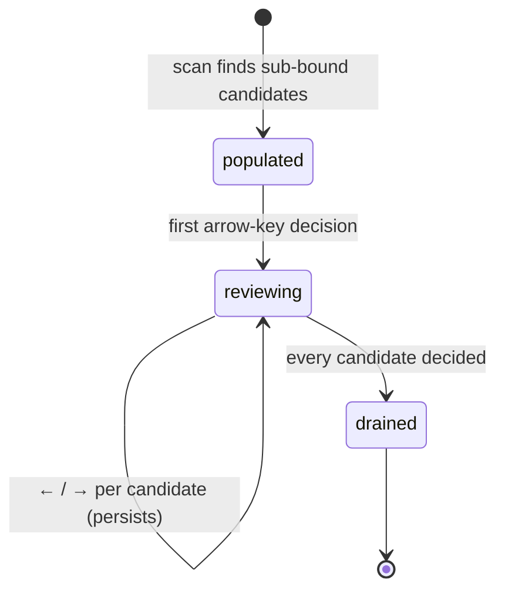

# The low-resolution review

## Summary

The low-resolution review — the **Low-res** tab — surfaces media whose display dimensions fall below a megapixel bound, so the user can decide whether small, likely throwaway copies deserve to stay. It is an item-at-a-time decision review: one candidate in focus, `←` to Delete it, `→` to Keep it, and every Keep is remembered durably so the file never resurfaces in future scans. Candidates are independent [review candidates](../glossary.md); what a scan does to find them is owned by [The scan pipeline](../foundations/scan-pipeline.md#how-each-detection-works), and the shared list mechanics by [Group list](group-list.md).

## The simple case

Low-resolution review is on by default. After a scan, the Low-res tab lists every image, GIF, or video below the bound — 1.0 megapixel per type by default — smallest first, with nothing selected. The user walks the list with `←` and `→`: `←` marks the focused candidate for deletion, `→` keeps it. Kept files are recorded in the keep-decisions file and stop appearing in future scans; deleted ones accumulate as selections until an [action](action-sheet.md) confirms them.

## The interaction, event by event

### Start

The scan probes dimensions for every eligible file (cheap header reads for images, ffprobe for videos) and selects those under the per-type bound: 1,000,000 pixels by default, separately configurable for images, GIFs, and videos in [Scan setup](scan-setup.md). Files with a durable [Keep decision](../glossary.md) are skipped entirely — they never resurface until they change. Candidates arrive in one independent group, ordered smallest first, nothing selected, nothing reviewed. Files whose dimensions could not be read are absent and reported among the scan's failures.

### End without changing anything

Browsing without deciding records nothing. The category is exactly as the scan produced it.

### Become extended

The first arrow-key decision makes the review consequential: the decision is sent to the server, applied, and the result persisted to the [review session](../foundations/review-session.md) at once.

### While extended

**Deciding.** The focused candidate is decided with `←` (Delete) or `→` (Keep); the detail pane advances. Each decision does two things: it marks the candidate *reviewed*, and it sets or clears its selection. A Delete selects; a Keep deselects. The member summary line reports "{N} of {count} reviewed · {M} selected for removal".

**What a Keep commits.** A reviewed, unselected low-resolution candidate is an explicit keep: the decision is written to the keep-decisions file, keyed to the file's identity. Future scans stop surfacing the file — the decision outlives this session, this scan, and this browser. If the file later changes, the identity no longer matches and the decision stops applying; the file can resurface. Withdrawing a Keep — selecting the candidate again — clears the stored decision.

**Overlapping groups.** The decision is written through *every* group the file belongs to: in other independent branches it becomes reviewed with the same selection state, and a Keep additionally removes the file from any duplicate group's selection — an explicit Keep vetoes automatic deletion everywhere, per the [effective-selection rules](../foundations/duplicate-group.md#what-actually-acts-the-effective-selection). The newest arrow-key decision wins wherever the file appears.

**Acting.** Deleted candidates stay selected until a confirmed action moves them. The entry point is the action bar's **Delete All Selected Low-res + Random** button (shared with the [random review](random-review.md)); the detail pane's summary line points at it while deletions are staged. A low-resolution selection has a different destination than most: review-category selections (low-res and random) are quarantined into `_Dedupe Quarantine` beside the scan root rather than sent to the system Trash — the [Action sheet](action-sheet.md) says so in its preview, and its Confirm button reads **Move to Quarantine**.

### Complete

The category drains as decisions accumulate: kept files vanish from future scans once their decisions persist, deleted files leave when an action executes. A candidate that is reviewed and unselected never acts — that is the point of the veto.

## Modifiers

| Modifier | Set at the start | Changed while extended |
| --- | --- | --- |
| Per-type pixel bounds | Define candidacy; configured in scan options, defaults 1.0 MP for each type. | Fixed for these results. |
| Keyboard vs mouse | `←`/`→` decisions and checkbox toggles reach the same server state. | Interchangeable. |
| Saved review session | Restores candidates, reviewed paths, selections. | Every decision saves it again. |
| Scan or action running | Locked; decision requests refused with "locked during active work". | Lock releases when the work ends. |

## Cancel and interrupt

| Event | Before decisions | While reviewing |
| --- | --- | --- |
| The user aborts explicitly | No effect. | There is no cancel; the opposite arrow key is the undo. A Keep after a Delete withdraws the selection and clears the stored decision. |
| The user does something else mid-way | No effect. | Switching tabs keeps all decisions; selections follow the files. |
| A clean complete happens elsewhere | No effect. | An executed action removes deleted candidates from the category; bulk selections rewrite what they touch. |
| The environment fails | Dimension-probe failures exclude files from candidacy and appear in scan diagnostics; a keep-decisions write failure is swallowed — the selection still applies, the durable memory does not. | A decision request that fails validation (stale scan id) leaves the server state unchanged and the page refreshes from it. |
| The page or process goes away | Reload restores from the server. | Decisions persist as made; at worst the one in flight is lost. |
| Something else changes the target | Invisible until action time. | Kept files that changed no longer match their decision; deleted files that changed fail the action's revalidation and stay put. |
| The input channel changes | No effect. | No effect. |
| A resumed review supersedes | One way the category is populated. | Resume locked during actions; otherwise replaces state with the session's pruned contents. |

## Interactions with other systems

**Files on disk.** Every Keep/withdraw writes the keep-decisions file (`~/.local/state/dedupe/keep-decisions.json`); decisions persist server-side in the review session. See [Files Dedupe writes](../cross-cutting/caches-and-files.md).

**Safety and undo.** Selections act only through the confirmed-action path with its full safety model; the reviewed-and-unselected veto is the category's own extra guarantee.

**Review sessions.** Review decisions ride in every session save; the keep-decisions file is the part that outlives sessions.

**Optional dependencies.** Video dimension probes need ffprobe; videos whose probe fails are excluded and reported.

**Concurrency and resource limits.** None beyond the shared list mechanics.

**macOS specifics.** None.

**Configuration and defaults.** On by default; 1.0 MP per type; decisions persist at the default keep-decisions path.

## Edge cases

- The same file in Low-res and in a duplicate group at once: keeping it here withdraws it from the duplicate group's automatic selection, even though the group still shows it.
- A Keep decision made, then the scan rerun with a *larger* bound: the file would still qualify by size, but the decision hides it anyway — decisions suppress regardless of the bound.
- Zero-dimension files never qualify (pixels must be greater than zero).
- The category's order is smallest first, so the most aggressive candidates come first.

## Open questions and verification

- The keep-decisions write failure being silently swallowed ("the durable store is a convenience") is explicit in the code; whether the UI should ever say so is a product question.
- The exact summary-line wording for this category was read from the shared member-summary renderer; confirm visually.
- Advancing past the last candidate stays on the pile; the decision that completes it raises a "Review complete — every file in this group has a decision" toast. Confirmed in `reviewCandidate` (`members.js`).

Verified against the post-improvement working tree (pinned at `2a6cede` plus the 2026-09 improvement phases; see the repository README for the commit).
