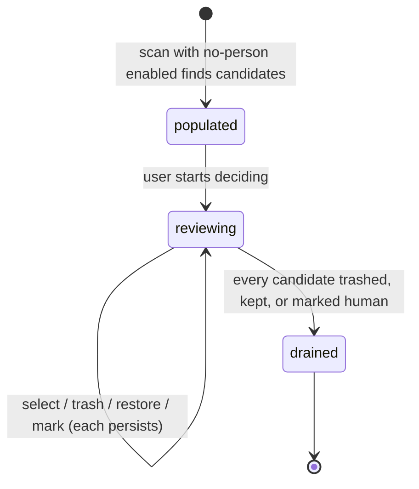

# The no-person review

## Summary

The no-person review — the **Non-Human** tab — is a computer-vision-assisted pass over media that appears to contain no people, surfaced so the user can decide whether to remove it. It is opt-in at scan time, conservative by design, and the UI is explicit that it is a review filter, not a guarantee: nothing arrives selected, and every file is the user's decision. Candidates are independent [review candidates](../glossary.md) — judged one at a time, not against each other — and may be selected in any number, trashed and restored individually, or cleared in bulk with **Mark all remaining as human**. What the scan does to produce the candidates is owned by [The scan pipeline](../foundations/scan-pipeline.md#how-each-detection-works); what happens to a selection at action time is owned by [Actions and undo](../foundations/actions-and-undo.md); the shared list mechanics (paging, focus, filters) are owned by [Group list](group-list.md).

## The simple case

In [Scan setup](scan-setup.md) the user enables the no-person review, leaves the backend on OpenCV (the default), and scans. When the scan finishes, the Non-Human tab lists every file whose analysis found no person, newest first, with nothing selected. The user pages through the candidates, looks at each one — the card shows how many frames were analyzed — and either trashes the ones they agree contain no people with a single click (or `d`), or selects some for a bulk action later, or leaves them alone. When the pile is exhausted, **Mark all remaining as human** records the rest as reviewed in a single confirmed step. Trashed candidates can be restored from their cards; marked and kept files do not resurface in future scans unless they change.

## The interaction, event by event

### Start

Detection runs during the scan only when the no-person review is enabled. Images, representative GIF frames, and up to 16 directly-seeked video frames are analyzed, with early exit the moment a person is found. The backend is chosen at scan time: `opencv` (default; the bundled YuNet face model runs first, then the full-body detector), `photon` (opt-in; Moondream through the local Photon runtime, roughly a 10 GB model download on first use), or `ensemble` (OpenCV positives first, then Photon on uncertain frames). The detectors report person/face boxes, not a calibrated confidence score, so the UI shows frame counts rather than scores.

Only *current* no-person decisions populate the category. The membership rule is applied again whenever results are loaded: a file whose verdict is positive, missing, or stale — recorded under a detector or model configuration that no longer matches — never appears in the flow. Such files are simply re-analyzed on the next scan. Candidates are ordered newest first by modification time. Nothing is selected, nothing is reviewed, and there is no suggested keeper — the independent-candidates policy. The list pages at 50 cards per page.

The category fails closed: if the bundled YuNet model is missing, corrupt, or cannot start, the scan surfaces no media as Non-Human at all. A broken detector produces an empty tab, not guesses.

### End without changing anything

Browsing candidates without deciding records nothing. The category remains exactly as the scan produced it; closing the page and returning shows the same list, since selections are held server-side.

### Become extended

The review becomes consequential at the first persisted decision: toggling a candidate's selection, trashing a candidate, or marking the remainder human. Each of these is applied on the server, validated against the current scan id, and the result is saved to the [review session](../foundations/review-session.md) at once.

### While extended

**Selecting.** Checkboxes and bulk operations work as in [Group list](group-list.md#while-extended), with one load-bearing rule from [Duplicate group](../foundations/duplicate-group.md#what-actually-acts-the-effective-selection): a candidate only counts toward an action when it is both selected *and* reviewed. Bulk-selecting candidates also marks them reviewed. A candidate that is reviewed and left unselected becomes a durable [Keep decision](../glossary.md): it is vetoed out of every deletion suggestion anywhere, including duplicate groups it may also belong to. The arrow-key Delete/Keep decisions belong to the low-resolution and random reviews; here `←`/`→` move the card focus and `Space` toggles the focused card's selection.

**Per-candidate Trash.** Each card offers a one-click Trash control (also `d`, `Delete`, or `Backspace` on the focused card, and the same keys or button inside the lightbox). Pressing it preflights the file under the same [safety model](../foundations/actions-and-undo.md#the-safety-model) as any action, then moves it to the macOS Trash in the same request — there is no confirmation sheet. If the file is not safely eligible, the delete stops with that reason and the card stays. Otherwise the card leaves the working pile immediately; a toast offers Undo for a few seconds, and **N in Trash · Show** reveals deleted cards with their restore control. Detection can miss people; the banner says so, and Trash remains recoverable.

**Per-candidate undo.** The restore control moves the file back from the Trash to its original path. It refuses if the original path is now occupied and reports "there is no deleted file to undo" when there is nothing to restore.

> Technical note: the restore reads the trashed candidate's destination from the review session, where the trash map is saved on every change. It therefore survives server restarts and resumes; only an entirely new scan clears it, after which recovery falls back to the macOS Trash.

**Mark all remaining as human.** The detail header's button asks, with the count, "Mark N remaining files as containing humans? They will not appear in future Non-Human scans unless the files change." Confirming records a manual-review decision for every candidate not already trashed this session, persists it through the hash cache, and removes those files from the category immediately. Manual decisions outrank detector versions — the detector signature is cleared — but the cache's file-identity check still applies: change the file, and the decision no longer matches it, so it can be re-analyzed and resurface. If the cache write fails, the in-memory markings are rolled back and the request reports the error; nothing half-persists.

### Complete

The category is consumed two ways: selections that are both reviewed and selected are carried into the [Action sheet](action-sheet.md) like any other, or the category is drained candidate by candidate until it dissolves — an independent group disappears when it runs out of members. Files marked human or kept simply stop appearing, in this scan and in future ones, until they change.

## Modifiers

| Modifier | Set at the start | Changed while extended |
| --- | --- | --- |
| Backend (opencv / photon / ensemble) | Chosen in scan setup; defines how the candidates were found. Photon's possible 10 GB download happens at scan time, never here. | Fixed for these results; the next scan chooses again. |
| Keyboard vs mouse | Equivalent paths to the same decisions; `d` / `Delete` / `Backspace` trash the focused card. | Fully interchangeable mid-review. |
| Saved review session | A resumed session restores candidates with their selections, pruned per [Review session](../foundations/review-session.md). | Every decision saves it again. |
| Scan or action running | Candidates stream or sit locked; decision requests are refused with "locked during active work". | The lock releases the moment the scan or action ends. |

## Cancel and interrupt

| Event | Before decisions | While reviewing |
| --- | --- | --- |
| The user aborts explicitly | No effect. | There is no cancel for a decision: deselecting is the undo for a selection, and a just-trashed candidate is restored from the toast or its card. |
| The user does something else mid-way | No effect. | Switching tabs or filters keeps all selections and deleted-candidate state; they follow the category, not the view. The mark-remaining button acts on whatever candidates remain undeleted at the moment it is confirmed. |
| A clean complete happens elsewhere | No effect. | An executed action removes acted-on candidates and may dissolve the group; a bulk selection rewrites whatever it touches; both persist immediately. |
| The environment fails | A failed-closed detector (YuNet missing or corrupt) yields an empty category rather than wrong candidates. | A per-candidate trash that fails preflight is refused with the file's reason; a cache failure during mark-remaining rolls the markings back and reports the error — the candidates stay. |
| The page or process goes away | Reload restores the category from the server's result. | Decisions persist server-side as they are made; at worst a crash loses the one in flight. The trash map is saved with the review session, so a restart keeps every undo control; only a new scan clears it. |
| Something else changes the target | Invisible until action time; cards show scan-time snapshots. | Caught by the safety model when a trash preview runs and again immediately before each move; a changed file is refused, not trashed. |
| The input channel changes | No effect. | No effect. |
| A resumed review supersedes | That is one way the category is populated; stale verdicts are filtered out during load. | Resume is refused while a scan or action holds the lock; otherwise it replaces the category with the session's pruned state. |

## Interactions with other systems

**Files on disk.** Manual "contains humans" decisions are persisted through the hash cache, keyed to file identity; trashed candidates go to the system Trash. No other files are touched by reviewing itself. The full list lives in [Files Dedupe writes](../cross-cutting/caches-and-files.md).

**Safety and undo.** Per-candidate trash runs the same preflight and token flow as the main actions ([Action sheet](action-sheet.md)), with one file in scope; symbolic links are refused like everywhere else. Undo is per-file and session-limited, as noted above.

**Review sessions.** Candidates, selections, reviewed paths, and the trashed candidates' destinations all ride in the session save; resume restores every one of them, including the undo controls.

**Optional dependencies.** OpenCV powers the default backend and is CPU-only with no runtime download; Photon is opt-in and downloads on first use; both are described in [Optional dependencies](../cross-cutting/optional-dependencies.md). Without OpenCV, the default backend cannot run and the category fails closed.

**Concurrency and resource limits.** Detection runs on the scan's worker budget (OpenCV detection is capped at 4 concurrent detector instances; Photon runs serially). Reviewing itself is light: card thumbnails are cached server-side.

**macOS specifics.** Trash and manual recovery go through the macOS Trash; HEIC/TIFF thumbnails are transcoded on demand.

**Configuration and defaults.** The review is off until enabled at scan time; the backend defaults to OpenCV; up to 16 video frames are sampled per file. None of this is configurable inside the review itself.

## Edge cases

- A candidate that also belongs to a duplicate group is governed by both: keeping it here vetoes its deletion there; selecting it there cannot override an explicit Keep decision made here.
- The mark-remaining count excludes candidates trashed this session — they are already decided.
- Obscured people, or people in video frames between the sampled positions, can still be missed; the category is a filter for review, never a verdict.
- When the last candidate is trashed, kept, or marked, the group empties and dissolves from the list.
- A file marked human that later changes is no longer covered by the decision; it may reappear after re-analysis in a future scan.

## Open questions and verification

- The exact card copy and layout for the analyzed-frame count were not verified against `app.js` in this session; the source README states the UI shows how many frames were analyzed.
- The per-candidate trash goes through the same action plumbing that writes receipts for other actions; whether a receipt lands in `~/.cache/dedupe/logs/` for a single-candidate trash should be confirmed by hand.
- The per-candidate undo survives restarts but not a new scan, which clears the trash map along with the rest of the superseded session; whether that deserves a longer memory is a product question.
- The source README mentions a scan-time "Mark reviewed + select non-human" affordance; it is not described here and belongs to `cli/scan.md` when written.
- Ensemble's division of labor (which frames escalate to Photon) is a scan-time detail owned by the scan pipeline; its user-visible effect beyond the frame count was not confirmed.

Verified against dedupe commit `2a6cede`.
