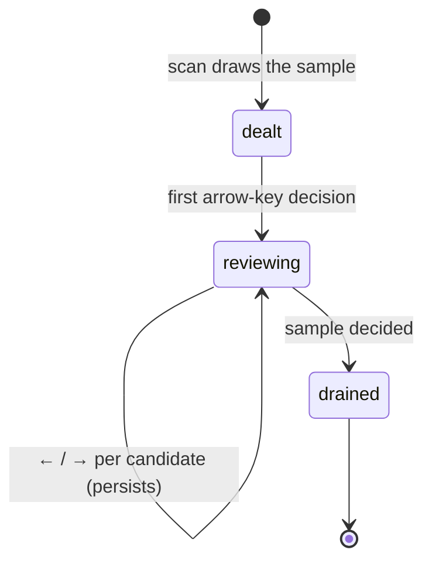

# The random review

## Summary

The random review — the **Random 50** tab — deals a fresh hand of up to fifty media files from the scan so the user can spot-check the scan's judgment on ordinary, unremarkable files: the ones no duplicate detector flagged. It uses the same item-at-a-time decision mechanics as the [low-resolution review](low-res-review.md) — `←` to Delete, `→` to Keep — with one deliberate difference: a Keep here records nothing durable, because the point is a sample, not a census. Candidates are independent [review candidates](../glossary.md); the shared list mechanics live in [Group list](group-list.md).

## The simple case

The random sample is on by default (50 files; configurable to zero). After a scan, the Random 50 tab shows up to fifty randomly chosen images, GIFs, and videos — unique, freshly drawn each scan — with nothing selected. The user walks it with `←` and `→`: Delete marks a candidate for removal, Keep marks it reviewed and leaves it. Deleting something here is how a file that no detector caught still gets removed; keeping costs nothing and records nothing.

## The interaction, event by event

### Start

After the detectors finish, the scan samples up to the configured count from all eligible media — images, GIFs, and videos — de-duplicated by path and drawn with a cryptographically fresh shuffle each scan. Same file, different scan: a different hand. The candidates form one independent group, nothing selected, nothing reviewed.

### End without changing anything

Browsing records nothing. Because a Keep records nothing either, an untouched or fully kept sample simply vanishes at the next scan — replaced by a new hand, with no memory of the last one.

### Become extended

The first arrow-key decision persists: the decision is applied server-side, validated against the current scan id, and saved to the [review session](../foundations/review-session.md).

### While extended

**Deciding.** `←` deletes the focused candidate (reviewed + selected), `→` keeps it (reviewed, unselected), and the pane advances — re-centering the candidate's media in the viewport on each step, as in the low-resolution review. `↑` / `↓` step back and forward through the sample without deciding, also as in the low-resolution review. The summary line reports reviewed and selected counts as in the other decision reviews. Decisions write through every group the file belongs to, exactly as in the [low-resolution review](low-res-review.md#while-extended): other independent branches see the reviewed state, and a Keep withdraws the file from duplicate groups' selections.

**Keeps are deliberately forgetful.** Unlike low-resolution candidates, a kept random candidate writes no durable decision — the keep-decisions sync applies only to the low-resolution category. Keeping a file in Random 50 means "not this one, today"; the next scan's sample does not remember.

**Acting.** Deleted candidates accumulate as selections until the action bar's **Delete All Selected Low-res + Random** button (shared with the [low-resolution review](low-res-review.md)) carries them into a confirmed action. Random-review selections follow the review-category rule: they are quarantined into `_Dedupe Quarantine` beside the scan root rather than sent to the system Trash, and the [Action sheet](action-sheet.md) preview reports the split.

### Complete

The sample drains as decisions are made; deleted files leave when an action executes. There is no completion state worth reaching — the category exists to be sampled, not exhausted.

## Modifiers

| Modifier | Set at the start | Changed while extended |
| --- | --- | --- |
| Sample size (random review count) | Default 50; 0 disables the category entirely. | Fixed for these results. |
| Keyboard vs mouse | Arrow decisions and checkbox toggles reach the same state. | Interchangeable. |
| Saved review session | Restores the sample with its reviewed/selected state. | Every decision saves it again. |
| Scan or action running | Locked; requests refused. | Lock releases when the work ends. |

## Cancel and interrupt

| Event | Before decisions | While reviewing |
| --- | --- | --- |
| The user aborts explicitly | No effect. | No cancel; the opposite arrow key undoes a decision for this session. |
| The user does something else mid-way | No effect. | Selections follow their files across tabs. |
| A clean complete happens elsewhere | No effect. | An executed action removes deleted candidates; bulk selections rewrite what they touch. |
| The environment fails | The sample is drawn after detection; a scan that finds nothing deals nothing. | Decision requests failing validation leave server state unchanged. |
| The page or process goes away | Reload restores from the server's result — the *sample itself* survives restarts because it lives in the result, even though keeps are forgetful. | Decisions persist as made. |
| Something else changes the target | Invisible until action time. | Changed files fail the action's revalidation and stay put. |
| The input channel changes | No effect. | No effect. |
| A resumed review supersedes | One way the category is populated (the sample rides in the session). | Locked during actions; otherwise replaced by the session's pruned state. |

## Interactions with other systems

**Files on disk.** The review session only — no keep-decisions file, no cache writes. See [Files Dedupe writes](../cross-cutting/caches-and-files.md).

**Safety and undo.** Selections act only through the confirmed-action path; reviewed-and-unselected candidates never act. The quarantine-not-trash destination for review categories is stated in the action preview.

**Review sessions.** The sample and its decisions ride in the session; a new scan deals a new hand and the old one is gone.

**Optional dependencies.** None: the sample draws from whatever the scan inventoried.

**Concurrency and resource limits.** None.

**macOS specifics.** None.

**Configuration and defaults.** 50 by default; configurable per scan in the UI options and via `--random-review-count` in the CLI.

## Edge cases

- A scan with fewer than fifty eligible files deals all of them.
- A file that is also in a duplicate group can be deleted from the random tab: its Keep/decided state propagates to the other branches as described, and the deletion acts once.
- Re-scanning the same folder twice yields two different samples — the shuffle is not seeded by the folder's contents.
- Setting the count to zero removes the tab's contents for that scan; previously stored session state for the category has nothing to attach to.

## Open questions and verification

- The forgetful-Keep behavior is verified in code (the keep-decisions sync skips non-low-resolution groups), and the review banner now says so: "Keep decisions here are not remembered between scans."
- The tab label reads "Random" regardless of the configured count; the count badge beside it shows the sample size. Confirmed in `index.html`.

Verified against the post-improvement working tree (pinned at `2a6cede` plus the 2026-09 improvement phases; see the repository README for the commit).
