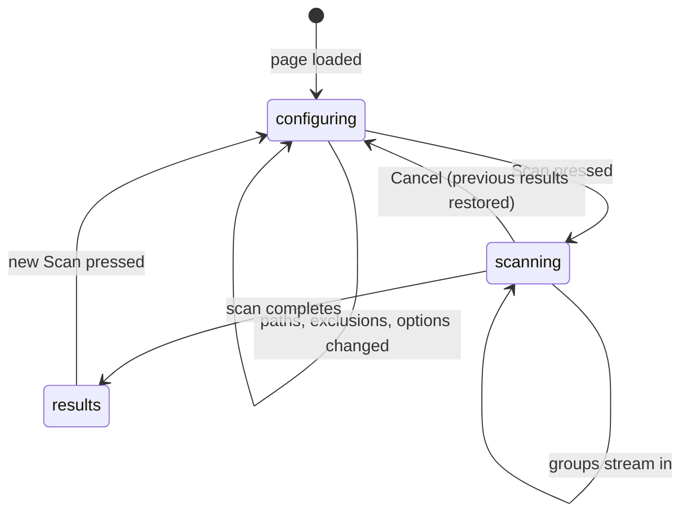

# Scan setup

## Summary

Scan setup is where every session begins: the user names one or more folders, optionally narrows what gets scanned, and starts the scan whose results fill the rest of the UI. It is the top of the single page served at `http://127.0.0.1:8765`, and it is also where a resumed session announces itself. Starting a scan replaces whatever results were loaded; the scan itself, stage by stage, is owned by [The scan pipeline](../foundations/scan-pipeline.md).

## The simple case

The user pastes a folder path — or clicks **Folders…** and picks one with the native macOS folder picker — and presses **Scan**. The setup form folds into a slim bar — a chevron, "Scan setup", and the scanned paths — so the results below get the screen; clicking the bar re-opens the form. A progress panel appears; the sidebar begins filling with groups as they are found. When the scan finishes, the progress line reports the totals ("Done — N exact, N similar groups, …"), the results are saved as the [review session](../foundations/review-session.md), and the user is looking at the [group list](group-list.md).

## The interaction, event by event

### Start

The page loads with whatever the server already holds: nothing (the setup form prominent), a completed result (the group list, with the setup form collapsed to its slim bar above it — no paths summary, since the server does not report what was scanned), or a resumed session (same, plus the [resumed-session banner](session-resume.md)). A page reload during a scan also collapses the form, leaving the live progress panel visible. The path field accepts one or more paths, comma-separated (a drag-and-drop or the native picker appends to the list); `~` is expanded by the server. Around it:

- **Folders…** opens the native folder picker; **Files…** opens a file picker for scanning specific files. Picked paths are appended to the field, deduplicated. Dragging text or a URI onto the field appends it the same way; dropping actual files or folders whose drag carries no text gets an error toast — "The browser can't read a dropped folder's location — use Folders… to pick it" — because the browser never exposes a dropped item's absolute path.
- **Recent folders** appear as chips below the field; clicking one appends its path to the field (deduplicated), exactly like the native picker. Recent paths are remembered in the browser's local storage.
- When the field holds two or more comma-separated paths and **Parallel streams** is on (the default for multiple folders), a hint under the field warns that the folders scan as parallel streams and duplicates *across* folders are not found, and suggests scanning the common parent folder or turning off Parallel streams. It appears and hides live as the paths are edited or the toggle changes.
- **Exclusions** — glob patterns, comma-separated — remove matching paths from the scan. A **Check** button beside the field walks the entered folders read-only with the real scan rules (hidden files skipped, excluded directories pruned, built-in patterns always applied), bounded at 100,000 visited entries, and reports each glob under the field as "✓ pattern — N matches" or "⚠ pattern — matches nothing (typo?)"; when the walk stops early the line says so and the counts are lower bounds. With an empty path field, Check asks for the folders first; with no globs entered it answers "No exclusion globs to check."
- **Scan options** (collapsible): exact and similar detection on/off; no-person review, which reveals a person-detector dropdown (`opencv`, `photon`, `ensemble`); faces counting; low-resolution review with per-type pixel bounds; random review count; images/GIFs/videos toggles; hidden files; similarity thresholds (image default 6, video default 8); worker count; cache on/off. When the raw threshold slider sits between preset values, the Similarity preset select shows a disabled "Custom (raw slider)" entry instead of going blank. Scan option values are remembered in the browser's local storage and restored on the next visit, and the panel closes with a note saying so: "Scan settings and recent folders are remembered in this browser only."
- **Dependency-gated options**: on page load, the server's startup dependency probe (reported in the status payload as `capabilities`) disables what cannot run, with the reason as a tooltip on the chip — Non-Human needs OpenCV with the bundled YuNet model or Photon, Count faces needs OpenCV. The person-detector dropdown disables its unavailable backends (`opencv` needs OpenCV and the YuNet model, `photon` the Moondream SDK, `ensemble` both) and switches to an available one when the saved choice is unavailable. A "Not installed: …" line inside the Detect group lists what is missing — including ffmpeg, which limits video similarity and thumbnails without disabling the Videos checkbox — and points to `dedupe doctor`.

Pressing Scan with an empty path list does nothing server-side: the request is rejected with "paths required".

### End without changing anything

Leaving the page without scanning records nothing. The server's auto-shutdown (closing the last tab stops the server) applies; see [`ui`](../cli/ui-command.md). A resumed session that the user never touches stays saved exactly as it was.

### Become extended

The scan becomes real the moment the server accepts it: a new scan id is issued, any previous preview tokens are voided, the previous result is held in reserve, and an empty result is installed so groups can stream into it. If a scan or an action is already running, the request is refused ("scan already running" / "file action already running") — one scan at a time.

Several folders default to **parallel streams**: each folder scans as its own concurrent stream with its own progress bar, and no duplicates are found across folders. The scan-options toggle can force a one-pool scan, which finds duplicates across folders ([Scan pipeline](../foundations/scan-pipeline.md#one-pool-vs-parallel-streams)).

### While extended

The progress panel shows the current phase and message — walking folders, cache hits, then the merged hashing progress with per-stage text ("Exact hash 12/340 · Images hashing: 5/200 · Videos hashing: 1/40"), then low-resolution probes, person and face detection if enabled. Counts, elapsed time, and an ETA update live. In parallel-streams mode, each folder shows its own line and fill bar plus one aggregate line.

Groups stream into the sidebar as they are finalized, kept sorted most-reclaimable-first. The user can already browse and open groups while the scan runs, but selections and actions are locked: selection changes and action requests get a "locked during active work" refusal.

### Complete

The progress line becomes the final summary; the result — files, groups, diagnostics — is installed and saved to the review session file at once. The action bar appears with its buttons enabled, keyed to the selection. If the scan found zero valid folders, the error message is shown instead and the *previous* results (if any) are restored unchanged.

## Modifiers

| Modifier | Set at the start | Changed while extended |
| --- | --- | --- |
| Scan options (thresholds, backends, toggles) | Define what this scan detects; defaults per [Scan pipeline](../foundations/scan-pipeline.md). Remembered in local storage for next time. | Options cannot change mid-scan; the next scan picks them up. |
| Exclusion globs | Remove matching paths before anything is read. | Same: fixed for the run. |
| Parallel streams vs one pool | Decided at start (default: streams when more than one folder). Cross-folder duplicates only exist in one-pool mode. | Fixed for the run. |
| Saved review session present | A prior session auto-loads on server start; a scan replaces it and saves the new one when complete. | No effect on the running scan. |

## Cancel and interrupt

| Event | Before Scan | During the scan |
| --- | --- | --- |
| The user aborts explicitly | Nothing to cancel. | **Cancel** sets the cooperative stop; the message becomes "Cancelling after current work item…" and the scan halts at the next checkpoint. The previous results (if any) are restored, and the cancelled scan leaves nothing behind — its partial groups are discarded, not saved. |
| The user does something else mid-way | Editing paths/options is the normal state. | Browsing streamed groups works; selection and action requests are refused until the scan ends. Starting another scan is refused. |
| A clean complete happens elsewhere | No effect. | No effect — there is exactly one scan at a time. |
| The environment fails | A Photos.app library root is refused with an export message; a missing folder is reported and skipped ([Scan pipeline](../foundations/scan-pipeline.md)). | Corrupt media files never abort the scan; they appear in the diagnostics. If the whole scan raises, the error is shown, previous results restored, and preview tokens voided. |
| The page or process goes away | No effect. | The scan runs server-side and continues through a browser reload — the page re-attaches to the running scan via its event stream (a server-sent-events channel, with a 350 ms status poll as fallback). Closing the last tab schedules server shutdown (1.5 s grace); a reload in time cancels it. Killing the server process loses the in-progress scan and whatever groups had streamed. |
| Something else changes the target | No effect until files are read. | Files are read as the scan reaches them; changes after reading are not noticed until revalidation at action time ([Actions and undo](../foundations/actions-and-undo.md#the-safety-model)). |
| The input channel changes | No effect. | No effect. |
| A resumed review supersedes | A resume is what the page shows instead of blank setup; starting a scan replaces it. | Resume/discard requests are locked out while scanning. |

## Interactions with other systems

**Files on disk.** A completed scan rewrites the review session file and updates the hash cache; an in-progress scan writes nothing but the cache at the end. Settings and recent folders live in browser local storage, not on the server.

**Safety and undo.** No files move during a scan; the scan's output is proposals.

**Review sessions.** The completed result is saved immediately; a previous session is superseded the moment the new scan completes.

**Optional dependencies.** The options panel gates itself on the server's startup dependency probe: options that need a missing dependency are disabled with the reason as a tooltip, and a "Not installed: …" line in the Detect group lists the gaps — including ffmpeg, which limits video similarity and thumbnails without disabling the Videos checkbox — and points to [`doctor`](../cli/doctor.md). Behind the gating, the scan-time fallbacks still apply: missing ffmpeg disables video similarity (with a diagnostic warning); missing OpenCV makes the no-person and faces options fail closed or refuse.

**Concurrency and resource limits.** The worker-count option defaults to auto (one fewer core than the machine has, capped at 8) and the UI shows the auto value and cap next to the slider.

**macOS specifics.** The native pickers (Folders…, Files…) use the macOS folder/file panels. Drag-and-drop accepts text and URI drops; a drop of files or folders that carries no text is answered with the "use Folders…" error toast instead of being silently ignored.

**Configuration and defaults.** Defaults: exact on, similar on, low-resolution on at 1 MP per type, random 50, no-person off, faces off, hidden files off, cache on, thresholds 6/8. All remembered per browser.

## Edge cases

- Scanning while results exist: the old results stay browsable only as a streaming placeholder — the empty result replaces them at scan start, and a failed scan restores them.
- The same folder listed twice is scanned twice in streams mode (one stream per listed folder after de-duplication of identical resolved paths).
- A scan of a folder that yields zero media files completes normally with an empty group list.
- Exclusion patterns are strings, still not validated at scan time — a typo simply matches nothing. The **Check** button beside the field is how a dead glob is caught before the scan starts.
- Changing the similarity threshold does not affect cached groupings of unchanged files until the hashes are recomputed — thresholds compare hashes; the hashes themselves are cached.

## Open questions and verification

- The exact behavior of the workers slider at the cap (label text, enforcement) was read from `updateWorkersUI` in `settings.js`, not watched by hand.
- The dependency gating (disabled chips, tooltips, the "Not installed: …" line) was read from `applyCapabilities` in `settings.js` and `detect_capabilities` in `app.py`; the drafting machine has every optional dependency installed, so the disabled state was not watched live. The cross-folder hint and the exclusion check are covered in a real browser by the e2e test `test_scan_setup_hints_and_exclusion_check`.

Verified against the post-improvement working tree (2026-09 UX phase; pinned at `2a6cede` plus later improvement commits).
