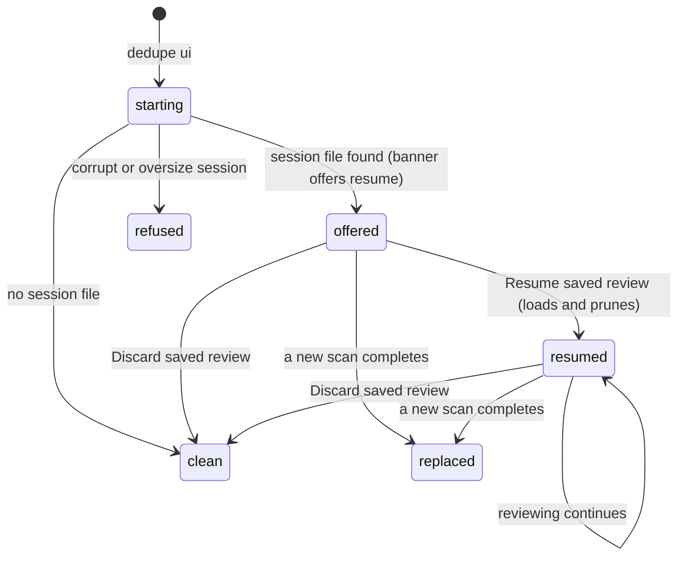

# Session resume

## Summary

Session resume is how Dedupe picks up where the user left off: when the server starts with a saved review session on disk, the page opens onto the empty scan setup with a banner offering to resume — the saved results are **not** loaded until the user clicks **Resume saved review**, at which point they are revalidated, pruned of everything that changed on disk, and installed with a banner accounting for the drops. This document covers what the user sees and can do at that moment; the pruning rules, the five reasons, and the atomic-save guarantees are owned by [The review session](../foundations/review-session.md).

## The simple case

The user scans and reviews, then quits. Next time `dedupe ui` starts, the page opens at the scan setup — no old results in view — with a banner: "Saved review from {when}" and a **Resume saved review** button. Clicking it loads the previous results — groups, selections, and review state — and the banner then summarizes what was dropped: how many files were pruned, per reason ("no longer on disk", "changed since the scan", …), with a "What was dropped?" list of up to 20 example files. The user keeps reviewing exactly where they stopped. If the saved session is stale or wrong, **Discard saved review** clears it and starts fresh.

## The interaction, event by event

### Start

On server start, before any browser connects, the app peeks at the session file (`~/.local/state/dedupe/review-session.json`, or `$XDG_STATE_HOME`) — reading only whether it exists and when it was saved. Three outcomes:

- **A valid session is found.** The page opens at the empty scan setup with the banner: "Saved review from {when}", a **Resume saved review** button, and **Discard saved review**. Nothing is loaded yet; the expensive per-file revalidation happens only on resume.
- **No session file.** The app starts clean at the scan setup; no banner.
- **A corrupt or oversize session.** The file is reported as corrupt (with its error) in the banner; the app starts clean rather than guessing at the contents. The file itself is left on disk.

### Resume

Clicking **Resume saved review** (refused while a scan or action is running) loads and revalidates the session: every file it mentions is checked against the disk; stale files are pruned for one of the five reasons ([The review session](../foundations/review-session.md#revalidating)); the shrunken result is installed as the current scan with progress reading "Resumed saved review", and the setup form folds away as with any loaded result. If anything was pruned, the shrunken session is saved back immediately, so the same drops are never reported twice. The banner now reads "Resumed review from {when}" and the resume button disappears — the offer is spent. If nothing was pruned, the session file is exactly what the resume validated; either way the same resume never reports drops twice.

### End without changing anything

A user who opens the page, looks at the offer, and leaves has changed nothing: the session file is untouched (startup peek never writes), and the results were never loaded. Closing the last tab stops the server; the next start repeats the same offer.

### Become extended

Once resumed, reviewing is indistinguishable from a fresh scan: the same [group list](group-list.md), the same [action sheet](action-sheet.md), the same locking rules. The resumed result carries a fresh scan id, so there is no notion of an "old" session accepted tentatively — every request is validated against the live state.

### While extended

The banner stays as a record of what pruning did; it does not block reviewing, and it is dismissible: its ✕ hides it for the rest of the page session. The dismissal is keyed to the session's identity — availability, corruption, saved-at time, pruned count, error — so a session that changes (a fresh save, new pruning at the next resume) re-shows the banner even after a dismissal, and a plain reload brings it back too. Selections made now persist through the normal save path. One asymmetry to know: files pruned at resume are gone from this review for good — they were not deleted from disk, but they are no longer in the result. The **What was dropped?** panel says so itself — "Dropped files only return through a fresh scan of the same folders." — and offers the one way back: **Rescan these folders** fills the path field from the saved review's roots (the session metadata now carries them), expands the scan setup, and starts the scan immediately.

### Complete

The resumed session "completes" the ways any review does: an executed action consumes selections ([Action sheet](action-sheet.md)), a new scan replaces the result and saves over the session, or **Discard saved review** deletes the session file and resets the page to empty scan setup. Discard asks nothing further; after it, the next start begins clean.

## Modifiers

| Modifier | Set at the start | Changed while extended |
| --- | --- | --- |
| Session file present and valid | Banner offers **Resume saved review**; results are not loaded until it is clicked. | No effect — the resume already happened. |
| Session file corrupt or oversize (> 64 MB) | App starts clean; the error is reported with the session metadata; the file is left untouched. | No effect until the file is removed or replaced by a new completed scan. |
| `XDG_STATE_HOME` set | The session is looked up under it instead of `~/.local/state`. | No effect at runtime. |
| Scan or action running | Resume and discard requests are refused while the app is busy ("review is locked during active work"). | They become available again when the work ends. |

## Cancel and interrupt

| Event | Before the resume is taken | While reviewing the resumed session |
| --- | --- | --- |
| The user aborts explicitly | **Discard saved review** deletes the session file and resets to empty setup; leaving the offer alone loads nothing. | Selections cannot be "cancelled"; they revert by deselecting, and every change persists as made. Discard remains available and wipes the whole session. |
| The user does something else mid-way | Starting a new scan while the offer stands replaces the session when it completes, spending the offer. | Switching categories or filters keeps the resumed selections; starting a new scan replaces the resumed result once it completes. |
| A clean complete happens elsewhere | No effect. | An executed action shrinks the resumed groups and saves; the session file afterwards reflects the post-action state. |
| The environment fails | A corrupt/oversize session degrades to a clean start with the error reported — the app never crashes on a bad session file. | If the session cannot be re-saved after a change (permissions, disk), the failure surfaces as "Could not save review: …" and the in-memory state stays ahead of the file. |
| The page or process goes away | A reload re-reads the same server state; the banner (and its resume button) reappear. Closing the last tab stops the server; the next start repeats the same offer. | Selections are saved server-side on every change, so a reload or restart loses nothing committed. |
| Something else changes the target | Not detected while the offer stands — the peek reads no file metadata. Files changed, moved, deleted, symlinked, or unreadable are caught when the resume revalidates, pruned with their reasons in the banner. | Files that change *after* the resume are caught at action time, not here ([Actions and undo](../foundations/actions-and-undo.md#the-safety-model)); a later explicit resume re-runs the whole revalidation. |
| The input channel changes | No effect. | No effect. |
| A resumed review supersedes | The resume installs a fresh scan id and voids any older authority. | A later explicit resume re-loads and re-prunes from disk, replacing the current result — refused while a scan or action holds the lock. |

## Interactions with other systems

**Files on disk.** One file: the review session JSON (private permissions, atomic writes). Discard deletes it; resume-time pruning rewrites it; completed scans overwrite it. Details in [Files Dedupe writes](../cross-cutting/caches-and-files.md).

**Safety and undo.** Resume itself never moves or deletes user files — pruning removes entries from the *review*, not from disk. Starting a new scan still clears the per-candidate Trash undo map kept for the [no-person](no-person-review.md) and [faces](faces-review.md) reviews, but the loss no longer passes silently: the scan starts with a one-time toast — "N files trashed earlier can still be restored from the Trash — the new scan ends in-app undo for them" — and Finder's Trash remains the restore path for those files. If the new scan is cancelled or fails, the previous result is restored with its undo map intact and the cleared count is withdrawn.

**Review sessions.** (This document; the mechanics live in [The review session](../foundations/review-session.md).)

**Optional dependencies.** None: resume-time revalidation reads file metadata only; no decoding or hashing happens during the load. The startup peek reads the session file's header only.

**Concurrency and resource limits.** The revalidation pass is a single-threaded metadata sweep over the session's files, bounded by the 64 MB session cap; it is the slowest part of a resume for very large sessions. It no longer runs at startup: the server opens at the scan setup immediately, and the sweep happens on the resume click.

**macOS specifics.** iCloud-evicted files fail readability at revalidation and are pruned as "could not be read" like any unreadable file.

**Configuration and defaults.** The session path honors `XDG_STATE_HOME`; nothing else is configurable, and results are never loaded without the explicit resume.

## Edge cases

- The banner reports up to 20 example files; a session that pruned thousands shows the per-reason totals and a sample, not the full list.
- The same file pruned from several groups counts once.
- A session whose every group pruned away loads as an empty result — the page shows a resumed review with no groups rather than starting clean, and a one-time toast explains it: "The saved review's files all changed or moved — nothing is left to review. Scan again for a fresh look."
- Discard during an active scan or action is refused with the lock message; it succeeds once the work ends. The resume offer is likewise refused while the app is busy.
- Resuming with no readable session on disk is a clean refusal (the button's error toast); the offer only stands while the file exists.
- After a failed scan restores previous results, the session file still holds the last *completed* scan — the next start offers that older state, not the failed attempt.

## Open questions and verification

- The banner's exact layout and wording (the "What was dropped?" disclosure control, whether reason labels are pluralized with counts, the placement of the dismiss ✕, **Resume saved review**, and **Rescan these folders**) was read from the rendering functions' names and the metadata shape, not confirmed by hand against the running UI.
- Whether a corrupt session surfaces its error text visibly in the banner or only through the status API should be checked in the product — the metadata carries both `corrupt` and `error`.
- The order of precedence when a scan was started from the CLI with a result handed to the app (`initial_result`) — which saves over the session file first — is exercised only by the launcher flow and was not reproduced here.

Verified against the post-improvement working tree (2026-09 UX phase; pinned at `2a6cede` plus later improvement commits).
