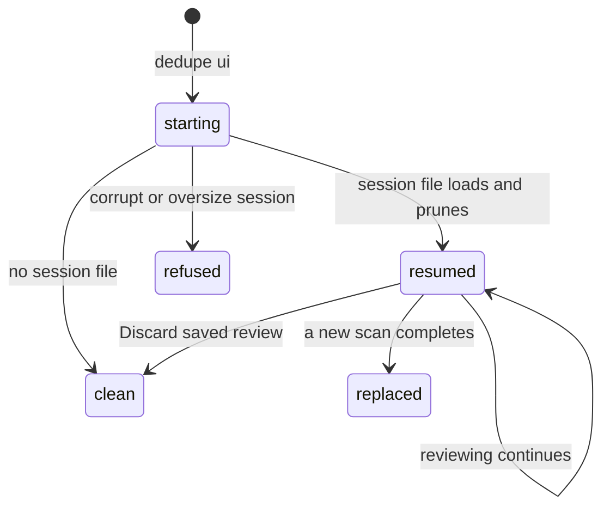

# Session resume

## Summary

Session resume is how Dedupe picks up where the user left off: when the server starts with a saved review session on disk, the pruned, revalidated results are loaded automatically and the page opens onto the old review instead of an empty scan setup — with a banner accounting for everything that changed on disk meanwhile. This document covers what the user sees and can do at that moment; the pruning rules, the five reasons, and the atomic-save guarantees are owned by [The review session](../foundations/review-session.md).

## The simple case

The user scans and reviews, then quits. Next time `dedupe ui` starts, the page opens with the previous results already loaded — groups, selections, and review state — and a banner summarizing what was dropped: how many files were pruned, per reason ("no longer on disk", "changed since the scan", …), with a "What was dropped?" list of up to 20 example files. The user keeps reviewing exactly where they stopped. If the saved session is stale or wrong, **Discard saved review** clears it and starts fresh.

## The interaction, event by event

### Start

On server start, before any browser connects, the app looks for the session file (`~/.local/state/dedupe/review-session.json`, or `$XDG_STATE_HOME`). Three outcomes:

- **A valid session loads.** Every file it mentions is revalidated against the disk; stale files are pruned for one of the five reasons ([The review session](../foundations/review-session.md#revalidating)); the shrunken result is installed as the current scan with progress reading "Resumed saved review". If anything was pruned, the shrunken session is saved back immediately, so the same drops are never reported twice.
- **No session file.** The app starts clean at the scan setup; no banner.
- **A corrupt or oversize session.** The file is reported as corrupt (with its error) and not loaded; the app starts clean rather than guessing at the contents. The file itself is left on disk.

When the browser first loads, the resumed-session metadata — saved time, pruned counts per reason, up to 20 example files — is shown in the banner area.

### End without changing anything

A user who opens the page, looks at the resumed review, and leaves has changed nothing: the session file is exactly what the pruning step saved at startup (or byte-identical to before when nothing was pruned). Closing the last tab stops the server; the next start repeats the same load — with zero new drops if the disk has not changed.

### Become extended

Resuming becomes active reviewing with the first interaction with the resumed groups — focusing a group, changing a selection. From there the experience is indistinguishable from a fresh scan: the same [group list](group-list.md), the same [action sheet](action-sheet.md), the same locking rules. The resumed result carries a fresh scan id, so there is no notion of an "old" session accepted tentatively — every request is validated against the live state.

### While extended

The banner stays as a record of what pruning did; it does not block reviewing. Selections made now persist through the normal save path. One asymmetry to know: files pruned at startup are gone from this review for good — they were not deleted from disk, but they are no longer in the result, and nothing in the UI brings a pruned file back short of rescanning.

### Complete

The resumed session "completes" the ways any review does: an executed action consumes selections ([Action sheet](action-sheet.md)), a new scan replaces the result and saves over the session, or **Discard saved review** deletes the session file and resets the page to empty scan setup. Discard asks nothing further; after it, the next start begins clean.

## Modifiers

| Modifier | Set at the start | Changed while extended |
| --- | --- | --- |
| Session file present and valid | Auto-resume on server start; banner shown. | No effect — the load happened before the page existed. |
| Session file corrupt or oversize (> 64 MB) | App starts clean; the error is reported with the session metadata; the file is left untouched. | No effect until the file is removed or replaced by a new completed scan. |
| `XDG_STATE_HOME` set | The session is looked up under it instead of `~/.local/state`. | No effect at runtime. |
| Scan or action running | Resume and discard requests are refused while the app is busy ("review is locked during active work"). | They become available again when the work ends. |

## Cancel and interrupt

| Event | Before reviewing begins | While reviewing the resumed session |
| --- | --- | --- |
| The user aborts explicitly | **Discard saved review** deletes the session file and resets to empty setup. | Selections cannot be "cancelled"; they revert by deselecting, and every change persists as made. Discard remains available and wipes the whole session. |
| The user does something else mid-way | Browsing the resumed groups without changing anything records nothing new. | Switching categories or filters keeps the resumed selections; starting a new scan replaces the resumed result once it completes. |
| A clean complete happens elsewhere | No effect. | An executed action shrinks the resumed groups and saves; the session file afterwards reflects the post-action state. |
| The environment fails | A corrupt/oversize session degrades to a clean start with the error reported — the app never crashes on a bad session file. | If the session cannot be re-saved after a change (permissions, disk), the failure surfaces as "Could not save review: …" and the in-memory state stays ahead of the file. |
| The page or process goes away | A reload re-reads the same server state; the banner reappears. Closing the last tab stops the server; the next start reloads the session again. | Selections are saved server-side on every change, so a reload or restart loses nothing committed. |
| Something else changes the target | That is what startup revalidation detects: changed, moved, deleted, symlinked, or unreadable files are pruned with their reasons in the banner. | Files that change *after* startup are caught at action time, not here ([Actions and undo](../foundations/actions-and-undo.md#the-safety-model)); a later explicit resume re-runs the whole revalidation. |
| The input channel changes | No effect. | No effect. |
| A resumed review supersedes | This is the resumption; it installs a fresh scan id and voids any older authority. | The explicit resume action re-loads and re-prunes from disk, replacing the current result — refused while a scan or action holds the lock. |

## Interactions with other systems

**Files on disk.** One file: the review session JSON (private permissions, atomic writes). Discard deletes it; startup pruning rewrites it; completed scans overwrite it. Details in [Files Dedupe writes](../cross-cutting/caches-and-files.md).

**Safety and undo.** Resume itself never moves or deletes user files — pruning removes entries from the *review*, not from disk.

**Review sessions.** (This document; the mechanics live in [The review session](../foundations/review-session.md).)

**Optional dependencies.** None: startup revalidation reads file metadata only; no decoding or hashing happens during the load.

**Concurrency and resource limits.** The revalidation pass is a single-threaded metadata sweep over the session's files, bounded by the 64 MB session cap; it is the slowest part of startup for very large sessions.

**macOS specifics.** iCloud-evicted files fail readability at revalidation and are pruned as "could not be read" like any unreadable file.

**Configuration and defaults.** The session path honors `XDG_STATE_HOME`; nothing else is configurable, and there is no way to disable auto-resume other than discarding or deleting the file.

## Edge cases

- The banner reports up to 20 example files; a session that pruned thousands shows the per-reason totals and a sample, not the full list.
- The same file pruned from several groups counts once.
- A session whose every group pruned away loads as an empty result — the page shows a resumed review with no groups rather than starting clean.
- Discard during an active scan or action is refused with the lock message; it succeeds once the work ends.
- After a failed scan restores previous results, the session file still holds the last *completed* scan — restart then resumes that older state, not the failed attempt.

## Open questions and verification

- The banner's exact layout and wording (the "What was dropped?" disclosure control, whether reason labels are pluralized with counts) was read from the rendering functions' names and the metadata shape, not confirmed by hand against the running UI.
- Whether a corrupt session surfaces its error text visibly in the banner or only through the status API should be checked in the product — the metadata carries both `corrupt` and `error`.
- The order of precedence when a scan was started from the CLI with a result handed to the app (`initial_result`) — which saves over the session file first — is exercised only by the launcher flow and was not reproduced here.

Verified against dedupe commit `2a6cede`.
