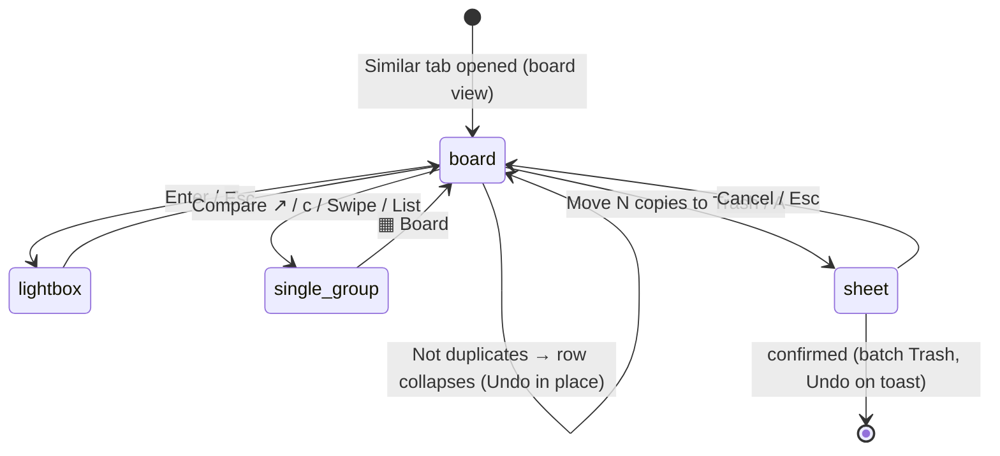

# The Similar board

## Summary

The Similar board is the default way to review the Similar category: every similar group on one screen, one compact row per group, so a library's near-duplicates are checked by scrolling instead of opening groups one at a time. Each row shows the suggested keeper first and its copies after it, every copy already marked Remove by the suggested selection. Clicking a photo (or `Space`) switches it between Keep and Remove, **Not duplicates** keeps every file in a group and stops it from matching again, and one footer button moves every marked copy to the system Trash through the usual [Action sheet](action-sheet.md) — one preview, one confirmation, one receipt, one Undo. The board replaces the sidebar and the single-group detail pane while the Similar tab is open; the swipe deck and the card list described in [The group list](group-list.md) stay one click away for any group. What a group's keeper and selection mean is owned by [Duplicate group](../foundations/duplicate-group.md).

## The simple case

After a scan the user opens the Similar tab and sees every similar group as a row, most reclaimable space first. Each tile has a green Keep or red Remove badge, a match chip (`99.1% match`, fingerprint agreement with the suggested keeper), dimensions, size, and file name. The user scrolls, clicks the occasional copy worth keeping, presses `n` on a row that is really two different photos, and finally presses the red **Move N copies to Trash · X MB** button at the bottom. The sheet confirms the count and size; after confirming, the copies are in the Trash, the finished rows leave the board, and the result toast offers Undo for the whole batch.

## The interaction, event by event

### Start

The board opens whenever the Similar tab is active and the remembered Similar view is the board — the default. The choice (Board, Swipe, or List) is stored in the browser's local storage and survives reloads. Outside the Similar tab — on All, for example — a similar group opens in the swipe deck even when the board is the remembered view.

The rows are the shown similar groups: the shared search, filters, and sort from the sidebar's result controls apply even though the sidebar is hidden. The board's search box mirrors the sidebar's, and when filters hide groups a line reads "N of M groups shown." with a **Clear filters** link. The board's own **Show** control adds one more filter: **Needs a look (< 95% match)** keeps only groups with at least one copy whose match is below 95% or unknown. The 95% cutoff is a fixed product choice, not configurable.

Inside a row, the suggested keeper comes first, labelled **Suggested keeper**, and the other members follow in the server's order. The order never changes with the selection, so tiles do not jump while the user works. The summary under the board's title reads "N groups · N copies marked for Trash · size"; the count is the effective selection across **all** similar groups, including ones hidden by filters, because that is what the footer button will move. A thumbnail-size slider (120–280 px, remembered) scales the tiles.

The first row is focused. Rows render in batches of 30; scrolling near the end appends the next batch, and a **Show N more** button does the same by hand.

> Technical note: the board is built in the browser from the group payloads already loaded for the group list; opening it makes no extra request. Thumbnails load lazily, and rows outside the viewport skip layout and paint.

### End without changing anything

Scrolling, focusing rows, hovering for the quick-look preview, and opening the lightbox change nothing. Switching to another tab, to Swipe or List, or reloading the page loses nothing; the selections shown are the server's.

### Become extended

The first Keep/Remove change makes the review consequential in the same way a checkbox does in the [group list](group-list.md#become-extended): the group's new selection is sent to the server, validated against the scan id, applied, and persisted to the review session. The tile changes and the footer total update immediately, before the server answers; rapid clicks in one group are coalesced so the server always ends on the latest choice.

### While extended

**Keep and Remove.** Clicking a tile's photo, or `Space` on the focused tile, switches that file between Keep and Remove. A group must keep at least one file: trying to mark the last kept file shows "Each group keeps at least one file — use “Keep only this” on another copy instead" and changes nothing. **Keep only this** under a tile (or `Shift+K`) keeps that file and marks every other member of the group, the suggested keeper included; `u` puts the focused row back to the suggested selection. Every change is the same selection the card checkboxes and the lightbox write, with the same server-side keeper protection.

**Not duplicates.** The row's **Not duplicates** button (or `n`) records every pair in the group as distinct — exactly like **Mark as distinct** in the list view — and the group leaves the Similar category now and in future scans. On the board the row does not vanish: it collapses in place to "Marked not duplicates — every file stays and this group won't come back" with an **Undo** link, and focus moves to the next row. Undo puts the group back where it was, with its selection, and drops only the distinct pairs that decision created; pairs decided earlier in the swipe deck stay recorded. The transient toast says "undo from the row" rather than carrying its own Undo, so a run of `n` presses never stacks sticky toasts.

**Looking closer.** Holding the pointer over a photo for a second shows the full-image quick-look. `Enter`, or the ⤢ button on a tile, opens the [lightbox](lightbox.md) on that file with the row's members in board order; its Mark for removal toggle (`d`, or `Space` when no button has focus) changes the same selection and the row repaints underneath. Esc returns focus to the focused tile. **Compare ↗** (or `c`) opens the row's group in the swipe deck with the sidebar back; **▦ Board** in that group's header returns to the board on the same row. The board toolbar's **Swipe** and **List** buttons switch the remembered view and open the focused group that way.

**Keyboard.** `j`/`↓` and `k`/`↑` move between rows, skipping collapsed ones; `←`/`→` move between the focused row's tiles; `r` reveals the focused file in Finder; `A` opens the Trash sheet. The board takes over these keys while it is shown: the group-list meanings (`[`/`]`, `s`, `d` per-candidate Trash) do not apply. `Space` and `Enter` on a focused button other than a tile activate that button as usual. The keys are listed in the footer, the **How it works** panel, and the `?` help.

**The footer.** On the board the action bar shows one red button, **Move N copies to Trash · size** (or "No copies marked for Trash", disabled), and hides the Low-res + Random button, which has nothing to do with this screen. Outside the board the similar button returns to its counted label, **Delete N similar matches · size**, and the Low-res + Random button comes back on the tabs it belongs to ([Group list](group-list.md#start)). The **? How it works** button at the end of the board's toolbar opens the guide and key list as a panel; the toolbar stays pinned while the rows scroll in a desktop-sized window.

### Complete

The footer button (or `A`) runs the Similar scope of the [Action sheet](action-sheet.md): a dry-run preview re-verifies every marked file, the sheet titled "Delete all selected similar matches?" shows the unique file count and size with the heuristic warning, and confirming moves them to the system Trash in one batch with one receipt. Moved members leave their groups, groups with fewer than two members dissolve, and the board re-renders from the new result — groups where the user kept extra copies stay on the board with those copies. The result toast's Undo restores the whole batch from the receipt, as described in [Actions and undo](../foundations/actions-and-undo.md).

## Modifiers

| Modifier | Set at the start | Changed while extended |
| --- | --- | --- |
| Remembered Similar view (Board / Swipe / List) | Board opens the board on the Similar tab; Swipe or List shows the sidebar and one group. | Switching from the toolbar or header takes effect at once and is remembered. |
| Search and sidebar filters | Narrow the rows; a "N of M groups shown" line appears. | Re-filter instantly; selections of hidden groups are kept and still counted in the footer. |
| Show: Needs a look | Keeps only groups with a copy under 95% match (or no score). | Re-filters instantly; nothing else changes. |
| Thumbnail size | Remembered from the last visit (default 180 px). | Rescales tiles live. |
| A scan running | Streamed similar groups appear as rows. | Keep/Remove and Not duplicates are refused with "Selections are locked while a scan or file action runs". |
| A file action running | Same lock as above. | Same lock; the footer button is disabled while the action is in flight. |

## Cancel and interrupt

| Event | Before the first change | While extended |
| --- | --- | --- |
| The user aborts explicitly | Nothing to abort. | Esc closes the lightbox or the Trash sheet; selections already made stay as they are (each one was saved when made). Cancelling the sheet moves nothing. |
| The user does something else mid-way | Switching tabs or views leaves nothing behind. | Same: selections are already on the server. A collapsed "Not duplicates" row is still undoable when the user comes back during the same scan session. |
| A clean complete happens elsewhere | An action confirmed in another tab updates the board on the next group refresh. | The same; a group whose copies were moved elsewhere re-renders without them or leaves the board. |
| The environment fails | Thumbnails that fail to load leave the tile without a picture; the row still works. | A refused selection shows its error toast and the board reloads the server's selections. A refused Not duplicates (for example the hash cache cannot be written) leaves the row as it was. |
| The page or process goes away | A reload reopens the board. | Selections survive reloads and server restarts through the review session. Collapsed "Not duplicates" rows and their Undo do not: the undo history lives in the server's memory and the page. |
| Something else changes the target | No effect until an action runs. | The Trash sheet's preview re-verifies every file; changed or missing files are skipped and counted, never moved blindly. |
| The input channel changes | No effect. | No effect. |
| A resumed review supersedes | Resuming installs a new scan session; the board shows its groups. | Pending "Not duplicates" rows from the previous session are dropped, and their Undo is no longer offered. |

## Interactions with other systems

**Files on disk.** Keep/Remove changes write only the review session file. **Not duplicates** writes distinct pairs into the hash cache, the same rows as **Mark as distinct**. The batch Trash writes a receipt under `~/.cache/dedupe/logs/`. See [Files Dedupe writes](../cross-cutting/caches-and-files.md).

**Safety and undo.** Nothing touches disk until the Trash sheet is confirmed, and that sheet is the standard preflight described in [Actions and undo](../foundations/actions-and-undo.md). The batch Undo restores from the receipt. "Not duplicates" Undo is separate and in-app only.

**Review sessions.** Selections persist like any other selection. The "Not duplicates" Undo history is not part of the session file and ends with the scan session.

**Optional dependencies.** None. Video members show their poster thumbnail with a Video badge; playback happens in the lightbox.

**Concurrency and resource limits.** Each Keep/Remove change is one small selection request; changes in the same group are serialized, and different groups are independent. File actions and scans hold the server's lock, during which the board refuses changes.

**macOS specifics.** Moved copies land in Finder's Trash. Reveal (`r`) opens Finder with the file selected.

**Configuration and defaults.** Board is the default Similar view; the 95% "needs a look" cutoff and the 30-row batch size are fixed.

## Edge cases

- Marking the suggested keeper for removal is allowed as long as another member stays kept; the board shows the suggested keeper with a Remove badge, and the batch Trash moves it.
- "Keep only this" on a file that is already the only kept one is not offered.
- A collapsed "Not duplicates" row keeps its position as rows above it change; its number is its position in the board, not a stable id.
- The footer counts every marked similar copy, including copies in groups hidden by search or the Needs a look filter.
- The match percentage always compares against the suggested keeper, even after the user keeps a different file.
- Sidebar rows for untouched similar groups read "◐ Suggested selection" rather than "✔ Reviewed": the selection is the automatic one until the user changes something in the group.

## Open questions and verification

- The 95% cutoff for "Needs a look" is a first guess, not tuned against a real library.
- Undo for "Not duplicates" lasts only for the scan session and only while the server keeps running; whether it should survive a server restart is open.
- Keyboard, toggle, Not duplicates + Undo, lightbox hand-off, Compare and back, and the batch Trash with its Undo are covered by the browser tests `test_similar_board_reviews_every_group_and_trashes_in_one_batch` and `test_similar_board_hands_off_to_compare_and_back`. The server undo is covered by `test_restore_group_undoes_a_whole_group_distinct_review` and its two refusal tests. The 30-row batching and the quick-look on board tiles were checked by hand in an orb against a 24-group scratch library, not on a large real library.

Verified against the post-improvement working tree (Similar board, 2026-10).
